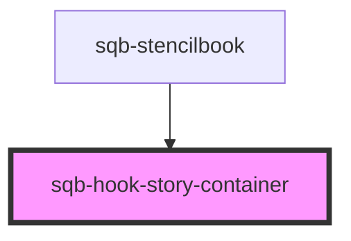

# sqb-hook-story-container

<!-- Auto Generated Below -->

## Properties

| Property    | Attribute | Description | Type                      | Default     |
| ----------- | --------- | ----------- | ------------------------- | ----------- |
| `hookStory` | --        |             | `FunctionalComponent<{}>` | `undefined` |

## Dependencies

### Used by

 - [sqb-stencilbook](../sqb-stencilbook)

### Graph

----------------------------------------------

*Built with [StencilJS](https://stenciljs.com/)*
