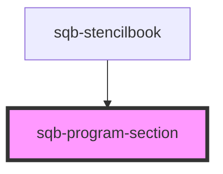

# sqb-program-section

<!-- Auto Generated Below -->

## Properties

| Property    | Attribute    | Description                                            | Type     | Default     |
| ----------- | ------------ | ------------------------------------------------------ | -------- | ----------- |
| `programId` | `program-id` | The program that everything in this section should use | `string` | `undefined` |

## Dependencies

### Used by

 - [sqb-stencilbook](../sqb-stencilbook)

### Graph

----------------------------------------------

*Built with [StencilJS](https://stenciljs.com/)*
