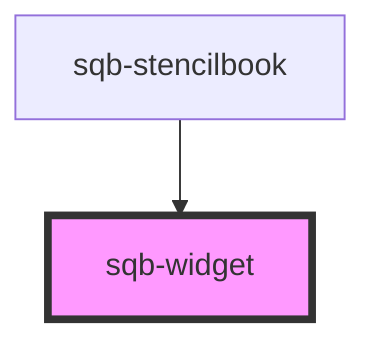

# stn-portal-entrypoint

<!-- Auto Generated Below -->

## Properties

| Property      | Attribute      | Description                                                                                                                                  | Type                            | Default     |
| ------------- | -------------- | -------------------------------------------------------------------------------------------------------------------------------------------- | ------------------------------- | ----------- |
| `demoData`    | --             |                                                                                                                                              | `{ data?: { html: string; }; }` | `undefined` |
| `requireAuth` | `require-auth` | When enabled then this widget is hidden until a user is logged in. Defaults to false.                                                        | `boolean`                       | `false`     |
| `trackLoads`  | `track-loads`  | When enabled then a load event will be recorded in analytics.                                                                                | `boolean`                       | `false`     |
| `widgetType`  | `widget-type`  | The type of widget to load. Can be a program's widget, a global widget, or a classic widget. If this prop is missing, then nothing is shown. | `string`                        | `undefined` |

## Dependencies

### Used by

 - [sqb-stencilbook](../sqb-stencilbook)

### Graph

----------------------------------------------

*Built with [StencilJS](https://stenciljs.com/)*
