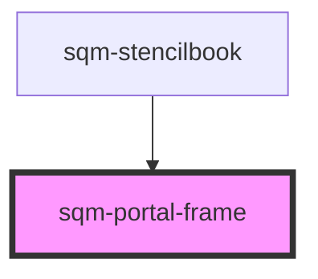

# sqm-portal-frame

<!-- Auto Generated Below -->

## Properties

| Property           | Attribute            | Description | Type      | Default     |
| ------------------ | -------------------- | ----------- | --------- | ----------- |
| `dashboardLabel`   | `dashboard-label`    |             | `string`  | `undefined` |
| `dashboardPath`    | `dashboard-path`     |             | `string`  | `undefined` |
| `description`      | `description`        |             | `string`  | `undefined` |
| `editProfileLabel` | `edit-profile-label` |             | `string`  | `undefined` |
| `headertext`       | `headertext`         |             | `string`  | `undefined` |
| `includeDropdown`  | `include-dropdown`   |             | `boolean` | `undefined` |
| `logoutLabel`      | `logout-label`       |             | `string`  | `undefined` |
| `logoutPath`       | `logout-path`        |             | `string`  | `undefined` |
| `menuLabel`        | `menu-label`         |             | `string`  | `undefined` |
| `profilePath`      | `profile-path`       |             | `string`  | `undefined` |

## Dependencies

### Used by

 - [sqm-stencilbook](../sqm-stencilbook)

### Graph

----------------------------------------------

*Built with [StencilJS](https://stenciljs.com/)*
