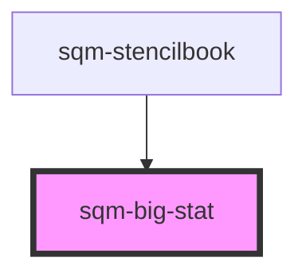

# sqm-big-stat

<!-- Auto Generated Below -->

## Properties

| Property               | Attribute                | Description                                                                                                 | Type                                                                                                                                                                                                                                                                                   | Default     |
| ---------------------- | ------------------------ | ----------------------------------------------------------------------------------------------------------- | -------------------------------------------------------------------------------------------------------------------------------------------------------------------------------------------------------------------------------------------------------------------------------------- | ----------- |
| `alignment`            | `alignment`              | Controls the alignment of the flexbox                                                                       | `"center" \| "left" \| "right"`                                                                                                                                                                                                                                                        | `"center"`  |
| `demoData`             | --                       |                                                                                                             | `{ loading?: boolean; value?: number; statvalue?: string; flexReverse?: boolean; alignment?: "left" \| "right" \| "center"; labelSlot?: VNode; statTextColor?: string; statFontSize?: number; descriptionTextColor?: string; descriptionFontSize?: number; statFontWeight?: number; }` | `undefined` |
| `descriptionFontSize`  | `description-font-size`  | Font size of the description text in pixels                                                                 | `number`                                                                                                                                                                                                                                                                               | `undefined` |
| `descriptionTextColor` | `description-text-color` | Color of the description text                                                                               | `string`                                                                                                                                                                                                                                                                               | `undefined` |
| `flexReverse`          | `flex-reverse`           | Controls the order of the stat value & description column                                                   | `boolean`                                                                                                                                                                                                                                                                              | `false`     |
| `programId`            | `program-id`             | The ID of the program that is used to scope stats. Defaults to the program context when no ID is specified. | `string`                                                                                                                                                                                                                                                                               | `undefined` |
| `statFontSize`         | `stat-font-size`         | Font size of the stat text in pixels                                                                        | `number`                                                                                                                                                                                                                                                                               | `undefined` |
| `statFontWeight`       | `stat-font-weight`       | Font weight of the stat text                                                                                | `number`                                                                                                                                                                                                                                                                               | `undefined` |
| `statTextColor`        | `stat-text-color`        | Color of the stat text                                                                                      | `string`                                                                                                                                                                                                                                                                               | `undefined` |
| `statType`             | `stat-type`              | Select what type of stat to display. Manual paths are also supported.                                       | `string`                                                                                                                                                                                                                                                                               | `undefined` |

## Dependencies

### Used by

 - [sqm-stencilbook](../sqm-stencilbook)

### Graph

----------------------------------------------

*Built with [StencilJS](https://stenciljs.com/)*
