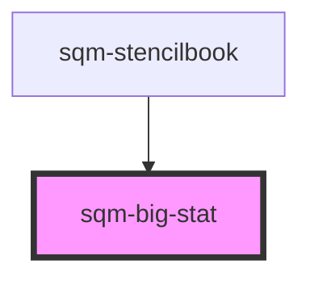

# sqm-big-stat

<!-- Auto Generated Below -->

## Properties

| Property                  | Attribute                    | Description                                                                                                 | Type                                                                                                                                                                                                                                                              | Default                      |
| ------------------------- | ---------------------------- | ----------------------------------------------------------------------------------------------------------- | ----------------------------------------------------------------------------------------------------------------------------------------------------------------------------------------------------------------------------------------------------------------- | ---------------------------- |
| `alignment`               | `alignment`                  | Controls the alignment of the flexbox                                                                       | `"center" \| "left" \| "right"`                                                                                                                                                                                                                                   | `undefined`                  |
| `demoData`                | --                           |                                                                                                             | `{ loading?: boolean; value?: number; statvalue?: string; flexReverse?: boolean; alignment?: "left" \| "right" \| "center"; labelSlot?: VNode; statColor?: string; statDescriptionColor?: string; statFontSize?: FontSize; statDescriptionFontSize?: FontSize; }` | `undefined`                  |
| `flexReverse`             | `flex-reverse`               | Controls the order of the stat value & description column                                                   | `boolean`                                                                                                                                                                                                                                                         | `false`                      |
| `programId`               | `program-id`                 | The ID of the program that is used to scope stats. Defaults to the program context when no ID is specified. | `string`                                                                                                                                                                                                                                                          | `undefined`                  |
| `statColor`               | `stat-color`                 |                                                                                                             | `string`                                                                                                                                                                                                                                                          | `"var(--sl-color-gray-800)"` |
| `statDescriptionColor`    | `stat-description-color`     |                                                                                                             | `string`                                                                                                                                                                                                                                                          | `"var(--sl-color-gray-600)"` |
| `statDescriptionFontSize` | `stat-description-font-size` |                                                                                                             | `"large" \| "medium" \| "small" \| "x-large" \| "x-small" \| "xx-large" \| "xx-small" \| "xxx-large" \| "xxxx-large"`                                                                                                                                             | `"small"`                    |
| `statFontSize`            | `stat-font-size`             |                                                                                                             | `"large" \| "medium" \| "small" \| "x-large" \| "x-small" \| "xx-large" \| "xx-small" \| "xxx-large" \| "xxxx-large"`                                                                                                                                             | `"x-large"`                  |
| `statType`                | `stat-type`                  | Select what type of stat to display. Manual paths are also supported.                                       | `string`                                                                                                                                                                                                                                                          | `undefined`                  |

## Dependencies

### Used by

 - [sqm-stencilbook](../sqm-stencilbook)

### Graph

----------------------------------------------

*Built with [StencilJS](https://stenciljs.com/)*
