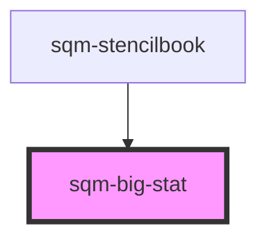

# sqm-big-stat

<!-- Auto Generated Below -->

## Properties

| Property      | Attribute      | Description                                                           | Type                                                                                        | Default     |
| ------------- | -------------- | --------------------------------------------------------------------- | ------------------------------------------------------------------------------------------- | ----------- |
| `alignment`   | `alignment`    |                                                                       | `"center" \| "left" \| "right"`                                                             | `undefined` |
| `demoData`    | --             |                                                                       | `{ statvalue?: string; flexReverse?: boolean; alignment?: "left" \| "right" \| "center"; }` | `undefined` |
| `flexReverse` | `flex-reverse` |                                                                       | `boolean`                                                                                   | `false`     |
| `statType`    | `stat-type`    | Select what type of stat to display. Manual paths are also supported. | `string`                                                                                    | `undefined` |

## Slots

| Slot                                 | Description |
| ------------------------------------ | ----------- |
| `"the description of the component"` |             |

## Dependencies

### Used by

 - [sqm-stencilbook](../sqm-stencilbook)

### Graph

----------------------------------------------

*Built with [StencilJS](https://stenciljs.com/)*
