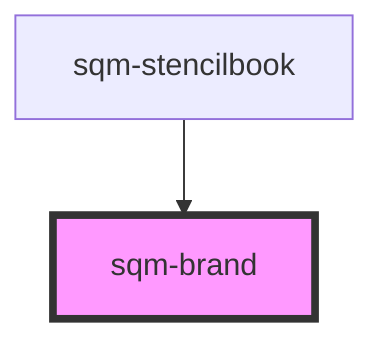

# sqm-brand

<!-- Auto Generated Below -->

## Properties

| Property          | Attribute          | Description                                                           | Type     | Default     |
| ----------------- | ------------------ | --------------------------------------------------------------------- | -------- | ----------- |
| `backgroundColor` | `background-color` |                                                                       | `string` | `undefined` |
| `borderRadius`    | `border-radius`    |                                                                       | `number` | `undefined` |
| `brandColor`      | `brand-color`      | Controls the primary brand color used in the Mint Components library. | `string` | `undefined` |
| `brandFont`       | `brand-font`       | The brand font that you want to use                                   | `string` | `undefined` |
| `fontColor`       | `font-color`       |                                                                       | `string` | `undefined` |

## Dependencies

### Used by

 - [sqm-stencilbook](../sqm-stencilbook)

### Graph

----------------------------------------------

*Built with [StencilJS](https://stenciljs.com/)*
