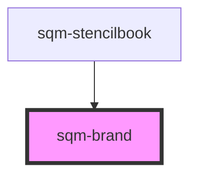

# sqm-brand

<!-- Auto Generated Below -->

## Properties

| Property     | Attribute     | Description                                                                                    | Type     | Default     |
| ------------ | ------------- | ---------------------------------------------------------------------------------------------- | -------- | ----------- |
| `brandColor` | `brand-color` | Controls the primary brand color used in the Mint Components library.                          | `string` | `undefined` |
| `brandFont`  | `brand-font`  | A font from the Google Fonts library used throughout the widget. This value is case sensitive. | `string` | `undefined` |

## Dependencies

### Used by

 - [sqm-stencilbook](../sqm-stencilbook)

### Graph

----------------------------------------------

*Built with [StencilJS](https://stenciljs.com/)*
