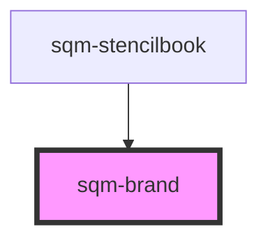

# sqm-brand

<!-- Auto Generated Below -->

## Properties

| Property     | Attribute     | Description                                                                                                                                           | Type     | Default     |
| ------------ | ------------- | ----------------------------------------------------------------------------------------------------------------------------------------------------- | -------- | ----------- |
| `brandColor` | `brand-color` | Controls the primary brand color used in the Mint Components library. Note that this does not affect vanilla components or other component libraries. | `string` | `undefined` |
| `brandFont`  | `brand-font`  | The brand font that you want to use                                                                                                                   | `string` | `undefined` |

## Slots

| Slot                                 | Description |
| ------------------------------------ | ----------- |
| `"the description of the component"` |             |

## Dependencies

### Used by

 - [sqm-stencilbook](../sqm-stencilbook)

### Graph

----------------------------------------------

*Built with [StencilJS](https://stenciljs.com/)*
