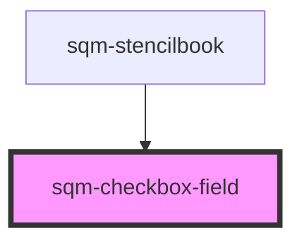

# sqm-checkbox-field

<!-- Auto Generated Below -->

## Properties

| Property                | Attribute                  | Description | Type                                                                                                                                                                                                                                                 | Default                                        |
| ----------------------- | -------------------------- | ----------- | ---------------------------------------------------------------------------------------------------------------------------------------------------------------------------------------------------------------------------------------------------- | ---------------------------------------------- |
| `checkboxLabel`         | `checkbox-label`           |             | `string`                                                                                                                                                                                                                                             | `"By signing up you agree to the {labelLink}"` |
| `checkboxLabelLink`     | `checkbox-label-link`      |             | `string`                                                                                                                                                                                                                                             | `"https://example.com"`                        |
| `checkboxLabelLinkText` | `checkbox-label-link-text` |             | `string`                                                                                                                                                                                                                                             | `"Terms and Conditions"`                       |
| `checkboxName`          | `checkbox-name`            |             | `string`                                                                                                                                                                                                                                             | `undefined`                                    |
| `checkboxOptional`      | `checkbox-optional`        |             | `boolean`                                                                                                                                                                                                                                            | `false`                                        |
| `demoData`              | --                         |             | `{ states?: { validationErrors?: ValidationErrors; checked: boolean; }; content?: { checkboxName: string; checkboxLabel: string; checkboxLabelLink?: string; checkboxLabelLinkText?: string; checkboxOptional?: boolean; errorMessage: string; }; }` | `undefined`                                    |
| `errorMessage`          | `error-message`            |             | `string`                                                                                                                                                                                                                                             | `"Must be checked"`                            |

## Dependencies

### Used by

 - [sqm-stencilbook](../sqm-stencilbook)

### Graph

----------------------------------------------

*Built with [StencilJS](https://stenciljs.com/)*
