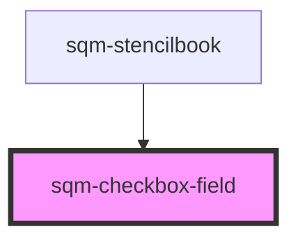

# sqm-checkbox-field

<!-- Auto Generated Below -->

## Properties

| Property                | Attribute                  | Description                                                                                                        | Type                                                                                                                                                                                                                                      | Default                                        |
| ----------------------- | -------------------------- | ------------------------------------------------------------------------------------------------------------------ | ----------------------------------------------------------------------------------------------------------------------------------------------------------------------------------------------------------------------------------------- | ---------------------------------------------- |
| `checkboxLabel`         | `checkbox-label`           |                                                                                                                    | `string`                                                                                                                                                                                                                                  | `"By signing up you agree to the {labelLink}"` |
| `checkboxLabelLink`     | `checkbox-label-link`      | Used with link text if the checkbox label contains {labelLink}                                                     | `string`                                                                                                                                                                                                                                  | `"https://example.com"`                        |
| `checkboxLabelLinkText` | `checkbox-label-link-text` |                                                                                                                    | `string`                                                                                                                                                                                                                                  | `"Terms and Conditions"`                       |
| `checkboxName`          | `checkbox-name`            | This name is used as the key for this form field on submission. The name must be unique within this specific form. | `string`                                                                                                                                                                                                                                  | `undefined`                                    |
| `checkboxOptional`      | `checkbox-optional`        |                                                                                                                    | `boolean`                                                                                                                                                                                                                                 | `false`                                        |
| `demoData`              | --                         |                                                                                                                    | `{ states?: { registrationFormState?: RegistrationFormState; checked: boolean; }; content?: { checkboxLabel: string; checkboxLabelLink?: string; checkboxLabelLinkText?: string; checkboxOptional?: boolean; errorMessage?: string; }; }` | `undefined`                                    |
| `errorMessage`          | `error-message`            |                                                                                                                    | `string`                                                                                                                                                                                                                                  | `"Must be checked"`                            |

## Dependencies

### Used by

 - [sqm-stencilbook](../sqm-stencilbook)

### Graph

----------------------------------------------

*Built with [StencilJS](https://stenciljs.com/)*
