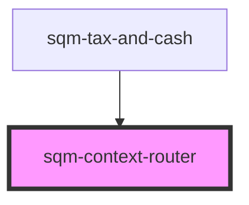

# sqm-router

<!-- Auto Generated Below -->

## Properties

| Property      | Attribute      | Description | Type     | Default     |
| ------------- | -------------- | ----------- | -------- | ----------- |
| `contextName` | `context-name` |             | `string` | `undefined` |

## Dependencies

### Used by

 - [sqm-tax-and-cash](../tax-and-cash/sqm-tax-and-cash)

### Graph

----------------------------------------------

*Built with [StencilJS](https://stenciljs.com/)*
