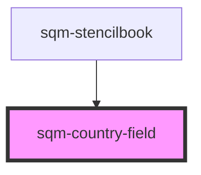

# sqm-country-field

<!-- Auto Generated Below -->

## Properties

| Property           | Attribute           | Description | Type                                                                                                                                                                                                                                             | Default                   |
| ------------------ | ------------------- | ----------- | ------------------------------------------------------------------------------------------------------------------------------------------------------------------------------------------------------------------------------------------------ | ------------------------- |
| `demoData`         | --                  |             | `{ states?: { validationErrors?: Record<string, string>; }; data?: { countries: Country[]; }; content?: { dropdownName: string; dropdownLabel: string; dropdownRequired?: boolean; errorMessage: string; selectOptions?: VNode \| VNode[]; }; }` | `undefined`               |
| `dropdownLabel`    | `dropdown-label`    |             | `string`                                                                                                                                                                                                                                         | `"Country"`               |
| `dropdownName`     | `dropdown-name`     |             | `string`                                                                                                                                                                                                                                         | `"countryCode"`           |
| `dropdownRequired` | `dropdown-required` |             | `boolean`                                                                                                                                                                                                                                        | `true`                    |
| `errorMessage`     | `error-message`     |             | `string`                                                                                                                                                                                                                                         | `"Must select a country"` |

## Dependencies

### Used by

 - [sqm-stencilbook](../sqm-stencilbook)

### Graph

----------------------------------------------

*Built with [StencilJS](https://stenciljs.com/)*
