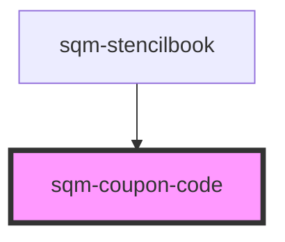

# sqm-coupon-code

<!-- Auto Generated Below -->

## Properties

| Property                | Attribute                 | Description                                                                                                             | Type                                                                                                                                                                                                                                                                                                                                                       | Default                                                                                                                 |
| ----------------------- | ------------------------- | ----------------------------------------------------------------------------------------------------------------------- | ---------------------------------------------------------------------------------------------------------------------------------------------------------------------------------------------------------------------------------------------------------------------------------------------------------------------------------------------------------- | ----------------------------------------------------------------------------------------------------------------------- |
| `buttonStyle`           | `copy-button-style`       | Set the copy button style and placement.                                                                                | `"button-below" \| "button-outside" \| "icon"`                                                                                                                                                                                                                                                                                                             | `"icon"`                                                                                                                |
| `cancelledErrorText`    | `cancelled-error-text`    | Display this message when the coupon code has been cancelled.                                                           | `string`                                                                                                                                                                                                                                                                                                                                                   | `"This code has been cancelled. Please reach out to the Support team for help resolving this issue."`                   |
| `copyButtonLabel`       | `copy-button-label`       |                                                                                                                         | `string`                                                                                                                                                                                                                                                                                                                                                   | `"Copy Coupon"`                                                                                                         |
| `couponCodePlaceholder` | `coupon-code-placeholder` | Display this text when the coupon code can’t be retrieved.                                                              | `string`                                                                                                                                                                                                                                                                                                                                                   | `"CODE ERROR"`                                                                                                          |
| `demoData`              | --                        |                                                                                                                         | `{ loading?: boolean; copyString?: string; tooltiptext?: string; open?: boolean; copyButtonLabel?: string; disabled?: boolean; textAlign?: "left" \| "right" \| "center"; buttonStyle?: "icon" \| "button-outside" \| "button-below"; error?: boolean; errorText?: string; inputPlaceholderText?: string; dateAvailable?: string; onClick?: () => void; }` | `undefined`                                                                                                             |
| `expiredErrorText`      | `expired-error-text`      | Display this message when the coupon code has expired.                                                                  | `string`                                                                                                                                                                                                                                                                                                                                                   | `"Looks like this code has expired. Please reach out to the Support team for help resolving this issue."`               |
| `fullfillmentErrorText` | `fullfilled-error-text`   | Display this message when the code fails to load due to a fulfillment error.                                            | `string`                                                                                                                                                                                                                                                                                                                                                   | `"We couldn't fetch your code. Please try again later or reach out to the Support team for help resolving this issue."` |
| `genericErrorText`      | `error-text`              | Display this message when the code fails to load due to an unspecified error.                                           | `string`                                                                                                                                                                                                                                                                                                                                                   | `"We couldn't fetch your code. Please try again later or reach out to the Support team for help resolving this issue."` |
| `programId`             | `program-id`              | The ID of the program that should generate the code. Defaults to the program ID in context where this widget is loaded. | `string`                                                                                                                                                                                                                                                                                                                                                   | `undefined`                                                                                                             |
| `textAlign`             | `text-align`              | Change the text alignment                                                                                               | `"center" \| "left" \| "right"`                                                                                                                                                                                                                                                                                                                            | `"left"`                                                                                                                |
| `tooltiplifespan`       | `tooltip-lifespan`        | The number of milliseconds that the tooltip appears for                                                                 | `number`                                                                                                                                                                                                                                                                                                                                                   | `1000`                                                                                                                  |
| `tooltiptext`           | `tooltip-text`            | Shown inside a tooltip after someone has successfully copied the link to their clipboard.                               | `string`                                                                                                                                                                                                                                                                                                                                                   | `"Copied to Clipboard"`                                                                                                 |

## Dependencies

### Used by

 - [sqm-stencilbook](../sqm-stencilbook)

### Graph

----------------------------------------------

*Built with [StencilJS](https://stenciljs.com/)*
