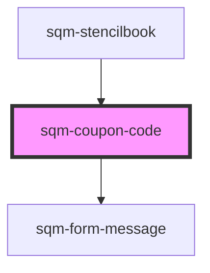

# sqm-coupon-code

<!-- Auto Generated Below -->

## Properties

| Property                | Attribute                 | Description                                                                                                                                  | Type                                                                                                                                                                                                                                                                                                                                                                                                                                                                                                                                                                                                                                                           | Default                                                                                                                 |
| ----------------------- | ------------------------- | -------------------------------------------------------------------------------------------------------------------------------------------- | -------------------------------------------------------------------------------------------------------------------------------------------------------------------------------------------------------------------------------------------------------------------------------------------------------------------------------------------------------------------------------------------------------------------------------------------------------------------------------------------------------------------------------------------------------------------------------------------------------------------------------------------------------------- | ----------------------------------------------------------------------------------------------------------------------- |
| `backgroundColor`       | `background-color`        | Background color of share link container                                                                                                     | `string`                                                                                                                                                                                                                                                                                                                                                                                                                                                                                                                                                                                                                                                       | `undefined`                                                                                                             |
| `borderColor`           | `border-color`            | Border color of share link container (default is set to 1px solid transparent)                                                               | `string`                                                                                                                                                                                                                                                                                                                                                                                                                                                                                                                                                                                                                                                       | `undefined`                                                                                                             |
| `borderRadius`          | `border-radius`           | The border radius on the share link container (in pixels)                                                                                    | `string`                                                                                                                                                                                                                                                                                                                                                                                                                                                                                                                                                                                                                                                       | `undefined`                                                                                                             |
| `buttonStyle`           | `copy-button-style`       | Set the copy button style and placement.                                                                                                     | `"button-below" \| "button-outside" \| "icon"`                                                                                                                                                                                                                                                                                                                                                                                                                                                                                                                                                                                                                 | `"icon"`                                                                                                                |
| `buttonType`            | `button-type`             | The type of the button (primary or secondary) that will be used to copy the link.                                                            | `"primary" \| "secondary"`                                                                                                                                                                                                                                                                                                                                                                                                                                                                                                                                                                                                                                     | `"primary"`                                                                                                             |
| `cancelledErrorText`    | `cancelled-error-text`    | Display this message when the coupon code has been cancelled.                                                                                | `string`                                                                                                                                                                                                                                                                                                                                                                                                                                                                                                                                                                                                                                                       | `"This code has been cancelled. Please reach out to the Support team for help resolving this issue."`                   |
| `copyButtonLabel`       | `copy-button-label`       |                                                                                                                                              | `string`                                                                                                                                                                                                                                                                                                                                                                                                                                                                                                                                                                                                                                                       | `"Copy Coupon"`                                                                                                         |
| `couponCodeLabel`       | `coupon-code-label`       |                                                                                                                                              | `string`                                                                                                                                                                                                                                                                                                                                                                                                                                                                                                                                                                                                                                                       | `"Your coupon code:"`                                                                                                   |
| `couponCodePlaceholder` | `coupon-code-placeholder` | Display this text when the coupon code can’t be retrieved.                                                                                   | `string`                                                                                                                                                                                                                                                                                                                                                                                                                                                                                                                                                                                                                                                       | `"..."`                                                                                                                 |
| `demoData`              | --                        |                                                                                                                                              | `{ loading?: boolean; textColor?: string; errorType?: "error" \| "warning" \| "info" \| "success"; couponCodeLabel?: string; buttonType?: "primary" \| "secondary"; copyString?: string; tooltiptext?: string; open?: boolean; copyButtonLabel?: string; disabled?: boolean; textAlign?: "left" \| "right" \| "center"; buttonStyle?: "icon" \| "button-outside" \| "button-below"; error?: boolean; errorText?: string; notificationText?: string; showNotificationText?: boolean; inputPlaceholderText?: string; dateAvailable?: string; isCopied?: boolean; backgroundColor?: string; borderRadius?: string; borderColor?: string; onClick?: () => void; }` | `undefined`                                                                                                             |
| `expiredErrorText`      | `expired-error-text`      | Display this message when the coupon code has expired.                                                                                       | `string`                                                                                                                                                                                                                                                                                                                                                                                                                                                                                                                                                                                                                                                       | `"Looks like this code has expired. Please reach out to the Support team for help resolving this issue."`               |
| `fullfillmentErrorText` | `fullfilled-error-text`   | Display this message when the code fails to load due to a fulfillment error.                                                                 | `string`                                                                                                                                                                                                                                                                                                                                                                                                                                                                                                                                                                                                                                                       | `"We couldn't fetch your code. Please try again later or reach out to the Support team for help resolving this issue."` |
| `genericErrorText`      | `error-text`              | Display this message when the code fails to load due to an unspecified error.                                                                | `string`                                                                                                                                                                                                                                                                                                                                                                                                                                                                                                                                                                                                                                                       | `"We couldn't fetch your code. Please try again later or reach out to the Support team for help resolving this issue."` |
| `pendingErrorText`      | `pending-error-text`      | Display this message when the coupon code not available yet. Use the ICU message, {unpendDate}, to show the date the code will be available. | `string`                                                                                                                                                                                                                                                                                                                                                                                                                                                                                                                                                                                                                                                       | `"Your code will be available on {unpendDate}. Mark your calendar and come back then to redeem your reward!"`           |
| `programId`             | `program-id`              | The ID of the program that should generate the code. Defaults to the program ID in context where this widget is loaded.                      | `string`                                                                                                                                                                                                                                                                                                                                                                                                                                                                                                                                                                                                                                                       | `undefined`                                                                                                             |
| `redeemedErrorText`     | `redeemed-error-text`     | Display this message when the coupon code has already been redeemed.                                                                         | `string`                                                                                                                                                                                                                                                                                                                                                                                                                                                                                                                                                                                                                                                       | `"Looks like you’ve already redeemed this code."`                                                                       |
| `textAlign`             | `text-align`              |                                                                                                                                              | `"center" \| "left" \| "right"`                                                                                                                                                                                                                                                                                                                                                                                                                                                                                                                                                                                                                                | `"left"`                                                                                                                |
| `textColor`             | `text-color`              | Color of the text and copy icon                                                                                                              | `string`                                                                                                                                                                                                                                                                                                                                                                                                                                                                                                                                                                                                                                                       | `undefined`                                                                                                             |
| `tooltiplifespan`       | `tooltip-lifespan`        | The number of milliseconds that the tooltip appears for                                                                                      | `number`                                                                                                                                                                                                                                                                                                                                                                                                                                                                                                                                                                                                                                                       | `1000`                                                                                                                  |
| `tooltiptext`           | `tooltip-text`            | Shown inside a tooltip after someone has successfully copied the link to their clipboard.                                                    | `string`                                                                                                                                                                                                                                                                                                                                                                                                                                                                                                                                                                                                                                                       | `"Copied to Clipboard"`                                                                                                 |

## Dependencies

### Used by

 - [sqm-stencilbook](../sqm-stencilbook)

### Depends on

- [sqm-form-message](../sqm-form-message)

### Graph

----------------------------------------------

*Built with [StencilJS](https://stenciljs.com/)*
