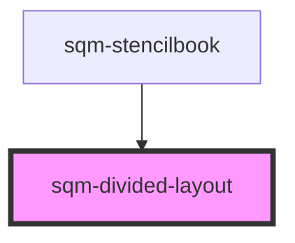

# sqm-sidebar-item

<!-- Auto Generated Below -->

## Properties

| Property           | Attribute            | Description                                                          | Type                | Default                                                       |
| ------------------ | -------------------- | -------------------------------------------------------------------- | ------------------- | ------------------------------------------------------------- |
| `backgroundColor`  | `background-color`   | Background color of the divider                                      | `string`            | `"#FFFFFF"`                                                   |
| `borderColor`      | `border-color`       | Color of the divider (defaults to default text color if none is set) | `string`            | `undefined`                                                   |
| `contentAreaWidth` | `content-area-width` | Overrides max-width of content area                                  | `string`            | `undefined`                                                   |
| `direction`        | `direction`          |                                                                      | `"column" \| "row"` | `undefined`                                                   |
| `dividerStyle`     | `divider-style`      |                                                                      | `string`            | `"var(--sqm-border-thickness) solid var(--sqm-border-color)"` |

## Dependencies

### Used by

 - [sqm-stencilbook](../sqm-stencilbook)

### Graph

----------------------------------------------

*Built with [StencilJS](https://stenciljs.com/)*
