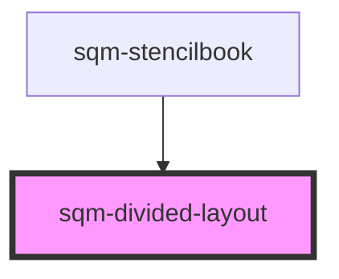

# sqm-sidebar-item

<!-- Auto Generated Below -->

## Properties

| Property    | Attribute   | Description | Type                | Default     |
| ----------- | ----------- | ----------- | ------------------- | ----------- |
| `direction` | `direction` |             | `"column" \| "row"` | `undefined` |

## Dependencies

### Used by

 - [sqm-stencilbook](../sqm-stencilbook)

### Graph

----------------------------------------------

*Built with [StencilJS](https://stenciljs.com/)*
