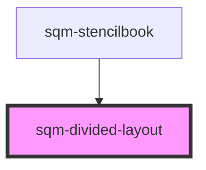

# sqm-sidebar-item

<!-- Auto Generated Below -->

## Properties

| Property           | Attribute            | Description                                                                                 | Type                | Default               |
| ------------------ | -------------------- | ------------------------------------------------------------------------------------------- | ------------------- | --------------------- |
| `contentAreaWidth` | `content-area-width` | Overrides max-width of content area                                                         | `string`            | `undefined`           |
| `direction`        | `direction`          |                                                                                             | `"column" \| "row"` | `undefined`           |
| `dividerStyle`     | `divider-style`      | Uses Shorthand CSS border syntax allowing specification of thickness, fill style and color. | `string`            | `"1px solid #EAEAEA"` |

## Dependencies

### Used by

 - [sqm-stencilbook](../sqm-stencilbook)

### Graph

----------------------------------------------

*Built with [StencilJS](https://stenciljs.com/)*
