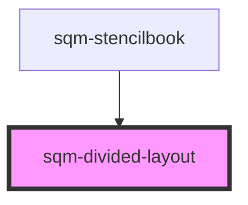

# sqm-sidebar-item

<!-- Auto Generated Below -->

## Properties

| Property       | Attribute       | Description                  | Type                | Default               |
| -------------- | --------------- | ---------------------------- | ------------------- | --------------------- |
| `direction`    | `direction`     |                              | `"column" \| "row"` | `undefined`           |
| `dividerStyle` | `divider-style` | Uses CSS border style syntax | `string`            | `"1px solid #EAEAEA"` |

## Dependencies

### Used by

 - [sqm-stencilbook](../sqm-stencilbook)

### Graph

----------------------------------------------

*Built with [StencilJS](https://stenciljs.com/)*
