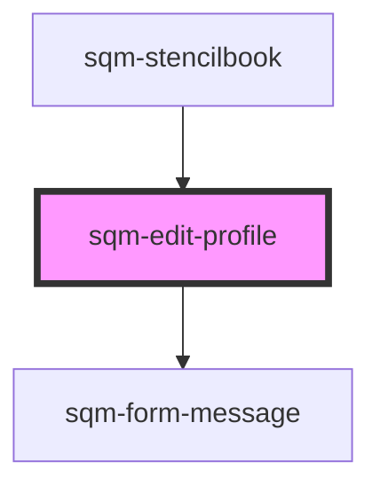

# sqm-edit-profile

<!-- Auto Generated Below -->

## Properties

| Property            | Attribute           | Description | Type      | Default     |
| ------------------- | ------------------- | ----------- | --------- | ----------- |
| `canceltext`        | `canceltext`        |             | `string`  | `undefined` |
| `currentregiontext` | `currentregiontext` |             | `string`  | `undefined` |
| `editprofileheader` | `editprofileheader` |             | `string`  | `undefined` |
| `editprofiletext`   | `editprofiletext`   |             | `string`  | `undefined` |
| `firstnametext`     | `firstnametext`     |             | `string`  | `undefined` |
| `lastnametext`      | `lastnametext`      |             | `string`  | `undefined` |
| `showregion`        | `showregion`        |             | `boolean` | `undefined` |
| `updatetext`        | `updatetext`        |             | `string`  | `undefined` |

## Dependencies

### Used by

 - [sqm-stencilbook](../sqm-stencilbook)

### Depends on

- [sqm-form-message](../sqm-form-message)

### Graph

----------------------------------------------

*Built with [StencilJS](https://stenciljs.com/)*
