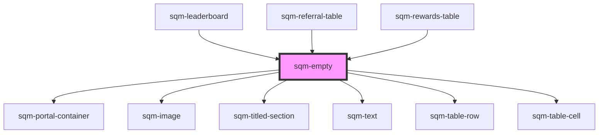

# sqm-empty

<!-- Auto Generated Below -->

## Properties

| Property           | Attribute            | Description | Type      | Default     |
| ------------------ | -------------------- | ----------- | --------- | ----------- |
| `emptyStateHeader` | `empty-state-header` |             | `string`  | `undefined` |
| `emptyStateImage`  | `empty-state-image`  |             | `string`  | `undefined` |
| `emptyStateText`   | `empty-state-text`   |             | `string`  | `undefined` |
| `table`            | `table`              |             | `boolean` | `undefined` |

## Dependencies

### Used by

 - [sqm-leaderboard](../sqm-leaderboard)
 - [sqm-referral-table](../sqm-referral-table)
 - [sqm-rewards-table](../sqm-rewards-table)

### Depends on

- [sqm-portal-container](../sqm-portal-container)
- [sqm-image](../sqm-image)
- [sqm-titled-section](../sqm-titled-section)
- [sqm-text](../sqm-text)
- [sqm-table-row](../sqm-table-row)
- [sqm-table-cell](../sqm-table-cell)

### Graph

----------------------------------------------

*Built with [StencilJS](https://stenciljs.com/)*
