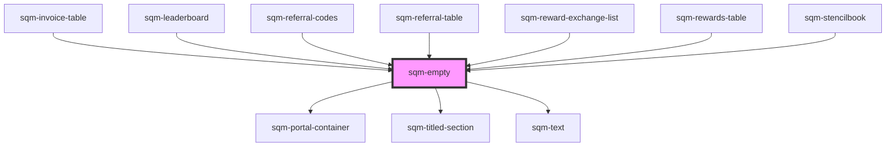

# sqm-empty

<!-- Auto Generated Below -->

## Properties

| Property           | Attribute            | Description | Type     | Default                                                                                                  |
| ------------------ | -------------------- | ----------- | -------- | -------------------------------------------------------------------------------------------------------- |
| `emptyStateHeader` | `empty-state-header` |             | `string` | `undefined`                                                                                              |
| `emptyStateImage`  | `empty-state-image`  |             | `string` | `"https://res.cloudinary.com/saasquatch/image/upload/v1644360953/squatch-assets/empty_leaderboard2.png"` |
| `emptyStateText`   | `empty-state-text`   |             | `string` | `undefined`                                                                                              |
| `supportText`      | `support-text`       |             | `string` | `undefined`                                                                                              |

## Dependencies

### Used by

 - [sqm-invoice-table](../sqm-invoice-table)
 - [sqm-leaderboard](../sqm-leaderboard)
 - [sqm-referral-codes](../sqm-referral-codes)
 - [sqm-referral-table](../sqm-referral-table)
 - [sqm-reward-exchange-list](../sqm-reward-exchange-list)
 - [sqm-rewards-table](../sqm-rewards-table)
 - [sqm-stencilbook](../sqm-stencilbook)

### Depends on

- [sqm-portal-container](../sqm-portal-container)
- [sqm-titled-section](../sqm-titled-section)
- [sqm-text](../sqm-text)

### Graph

----------------------------------------------

*Built with [StencilJS](https://stenciljs.com/)*
