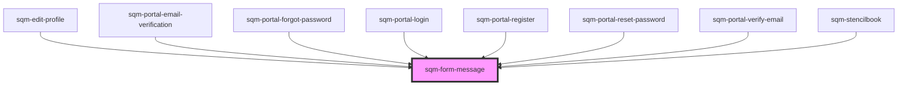

# sqm-form-message

<!-- Auto Generated Below -->

## Properties

| Property | Attribute | Description | Type     | Default     |
| -------- | --------- | ----------- | -------- | ----------- |
| `icon`   | `icon`    |             | `string` | `undefined` |
| `type`   | `type`    |             | `string` | `undefined` |

## Dependencies

### Used by

 - [sqm-edit-profile](../sqm-edit-profile)
 - [sqm-portal-email-verification](../portal-email-verification)
 - [sqm-portal-forgot-password](../portal-forgot-password)
 - [sqm-portal-login](../portal-login)
 - [sqm-portal-register](../portal-register)
 - [sqm-portal-reset-password](../portal-reset-password)
 - [sqm-portal-verify-email](../portal-verify-email)
 - [sqm-stencilbook](../sqm-stencilbook)

### Graph

----------------------------------------------

*Built with [StencilJS](https://stenciljs.com/)*
