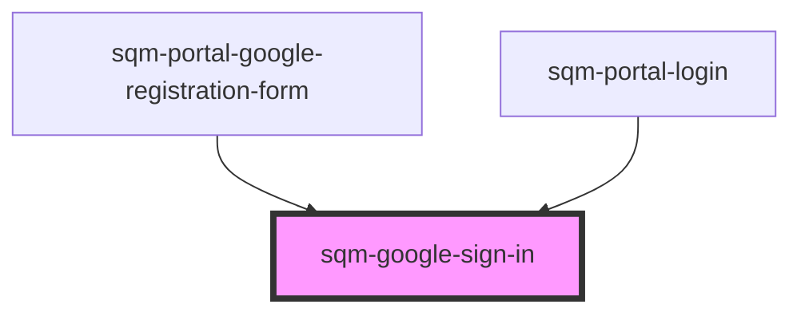

# sqm-google-sign-in

<!-- Auto Generated Below -->

## Properties

| Property | Attribute | Description | Type     | Default     |
| -------- | --------- | ----------- | -------- | ----------- |
| `text`   | `text`    |             | `string` | `undefined` |

## Events

| Event          | Description | Type               |
| -------------- | ----------- | ------------------ |
| `initComplete` |             | `CustomEvent<any>` |

## Dependencies

### Used by

 - [sqm-portal-google-registration-form](../sqm-portal-google-registration-form)
 - [sqm-portal-login](../sqm-portal-login)

### Graph

----------------------------------------------

*Built with [StencilJS](https://stenciljs.com/)*
