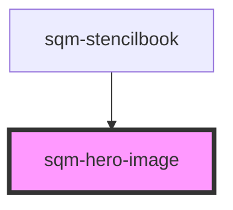

# sqm-hero-image

<!-- Auto Generated Below -->

## Properties

| Property          | Attribute          | Description                                                                                                       | Type                                                                                                                                           | Default        |
| ----------------- | ------------------ | ----------------------------------------------------------------------------------------------------------------- | ---------------------------------------------------------------------------------------------------------------------------------------------- | -------------- |
| `backgroundColor` | `background-color` |                                                                                                                   | `string`                                                                                                                                       | `undefined`    |
| `buttonLink`      | `button-link`      |                                                                                                                   | `string`                                                                                                                                       | `undefined`    |
| `buttonNewTab`    | `button-new-tab`   |                                                                                                                   | `boolean`                                                                                                                                      | `false`        |
| `buttonText`      | `button-text`      |                                                                                                                   | `string`                                                                                                                                       | `undefined`    |
| `buttonType`      | `button-type`      | The type of the button that is used (primary or secondary).                                                       | `"primary" \| "secondary"`                                                                                                                     | `"primary"`    |
| `description`     | `description`      |                                                                                                                   | `string`                                                                                                                                       | `undefined`    |
| `header`          | `header`           |                                                                                                                   | `string`                                                                                                                                       | `undefined`    |
| `imageAlt`        | `image-alt`        | Alt text for the hero image (columns layout). Leave empty for decorative images.                                  | `string`                                                                                                                                       | `""`           |
| `imageMobilePos`  | `image-mobile-pos` |                                                                                                                   | `"bottom" \| "top"`                                                                                                                            | `"top"`        |
| `imagePercentage` | `image-percentage` |                                                                                                                   | `number`                                                                                                                                       | `50`           |
| `imagePos`        | `image-pos`        |                                                                                                                   | `"center" \| "left" \| "right"`                                                                                                                | `"center"`     |
| `imageUrl`        | `image-url`        |                                                                                                                   | `string`                                                                                                                                       | `undefined`    |
| `layout`          | `layout`           |                                                                                                                   | `"columns" \| "overlay"`                                                                                                                       | `"overlay"`    |
| `minHeight`       | `min-height`       | Minimum height of the component in pixels. Reserves vertical space to prevent layout shift while the image loads. | `number`                                                                                                                                       | `400`          |
| `overlayColor`    | `overlay-color`    |                                                                                                                   | `string`                                                                                                                                       | `undefined`    |
| `overlayOpacity`  | `overlay-opacity`  |                                                                                                                   | `string`                                                                                                                                       | `"0.75"`       |
| `paddingImage`    | `padding-image`    |                                                                                                                   | `"large" \| "medium" \| "none" \| "small" \| "x-large" \| "x-small" \| "xx-large" \| "xx-small" \| "xxx-large" \| "xxx-small" \| "xxxx-large"` | `"none"`       |
| `paddingText`     | `padding-text`     |                                                                                                                   | `"large" \| "medium" \| "none" \| "small" \| "x-large" \| "x-small" \| "xx-large" \| "xx-small" \| "xxx-large" \| "xxx-small" \| "xxxx-large"` | `"xxxx-large"` |
| `textColor`       | `text-color`       |                                                                                                                   | `string`                                                                                                                                       | `undefined`    |

## Dependencies

### Used by

 - [sqm-stencilbook](../sqm-stencilbook)

### Graph

```mermaid
graph TD;
  sqm-stencilbook --> sqm-hero-image
  style sqm-hero-image fill:#f9f,stroke:#333,stroke-width:4px
```

----------------------------------------------

*Built with [StencilJS](https://stenciljs.com/)*
