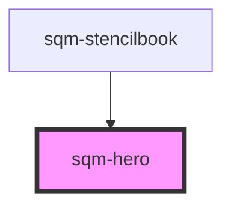

# sqm-hero

<!-- Auto Generated Below -->

## Properties

| Property               | Attribute                  | Description                                                             | Type                                       | Default     |
| ---------------------- | -------------------------- | ----------------------------------------------------------------------- | ------------------------------------------ | ----------- |
| `background`           | `background`               | Add an image or select a color. Recommended image aspect ratio of 4:5   | `string`                                   | `"#f9fafb"` |
| `columnToHideInMobile` | `column-to-hide-in-mobile` |                                                                         | `"primary" \| "secondary"`                 | `null`      |
| `columns`              | `columns`                  |                                                                         | `1 \| 2`                                   | `1`         |
| `minHeight`            | `min-height`               | Minimum height of each column including when they are stacked on mobile | `number`                                   | `200`       |
| `paddingSize`          | `padding-size`             |                                                                         | `"large" \| "medium" \| "none" \| "small"` | `"large"`   |
| `secondaryBackground`  | `secondary-background`     | Secondary background image or color (for use in the right column)       | `string`                                   | `undefined` |
| `wrapDirection`        | `wrap-direction`           | Flexbox wrap direction, accepts wrap or wrap-reverse                    | `"wrap" \| "wrap-reverse"`                 | `"wrap"`    |

## Dependencies

### Used by

 - [sqm-stencilbook](../sqm-stencilbook)

### Graph

----------------------------------------------

*Built with [StencilJS](https://stenciljs.com/)*
