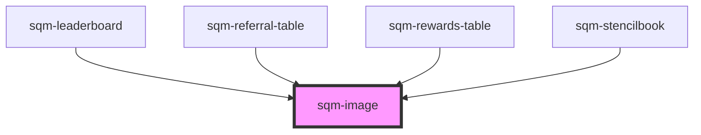

# sqm-image

<!-- Auto Generated Below -->

## Properties

| Property          | Attribute          | Description                                     | Type                            | Default     |
| ----------------- | ------------------ | ----------------------------------------------- | ------------------------------- | ----------- |
| `alignment`       | `alignment`        |                                                 | `"center" \| "left" \| "right"` | `"center"`  |
| `backgroundColor` | `background-color` |                                                 | `string`                        | `undefined` |
| `imageUrl`        | `image-url`        |                                                 | `string`                        | `undefined` |
| `left`            | `left`             |                                                 | `string`                        | `undefined` |
| `maxWidth`        | `max-width`        | (optional) Helps with constraining maximum size | `string`                        | `undefined` |
| `minHeight`       | `min-height`       | (optional) Helps with constraining minimum size | `string`                        | `undefined` |
| `right`           | `right`            |                                                 | `string`                        | `undefined` |

## Dependencies

### Used by

 - [sqm-leaderboard](../sqm-leaderboard)
 - [sqm-referral-table](../sqm-referral-table)
 - [sqm-rewards-table](../sqm-rewards-table)
 - [sqm-stencilbook](../sqm-stencilbook)

### Graph

----------------------------------------------

*Built with [StencilJS](https://stenciljs.com/)*
