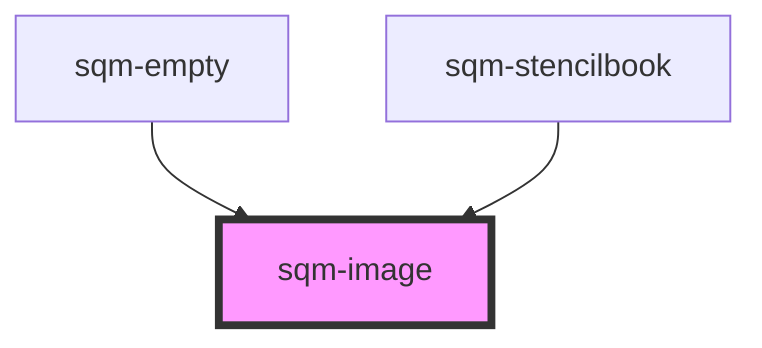

# sqm-image

<!-- Auto Generated Below -->

## Properties

| Property          | Attribute          | Description                                                                                                               | Type                            | Default     |
| ----------------- | ------------------ | ------------------------------------------------------------------------------------------------------------------------- | ------------------------------- | ----------- |
| `alignment`       | `alignment`        |                                                                                                                           | `"center" \| "left" \| "right"` | `"center"`  |
| `backgroundColor` | `background-color` |                                                                                                                           | `string`                        | `undefined` |
| `imageUrl`        | `image-url`        |                                                                                                                           | `string`                        | `undefined` |
| `minHeight`       | `min-height`       | (Optional) Helps with constraining the minimum image size. Can be a pixel value or a percentage i.e. "500px", "33%", etc. | `string`                        | `undefined` |

## Dependencies

### Used by

 - [sqm-empty](../sqm-empty)
 - [sqm-stencilbook](../sqm-stencilbook)

### Graph

----------------------------------------------

*Built with [StencilJS](https://stenciljs.com/)*
