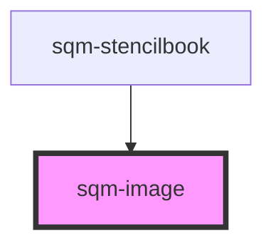

# sqm-image

<!-- Auto Generated Below -->

## Properties

| Property          | Attribute          | Description | Type                            | Default     |
| ----------------- | ------------------ | ----------- | ------------------------------- | ----------- |
| `align`           | `align`            |             | `"center" \| "left" \| "right"` | `"center"`  |
| `backgroundColor` | `background-color` |             | `string`                        | `undefined` |
| `imageUrl`        | `image-url`        |             | `string`                        | `undefined` |
| `left`            | `left`             |             | `string`                        | `undefined` |
| `right`           | `right`            |             | `string`                        | `undefined` |

## Dependencies

### Used by

 - [sqm-stencilbook](../sqm-stencilbook)

### Graph

----------------------------------------------

*Built with [StencilJS](https://stenciljs.com/)*
