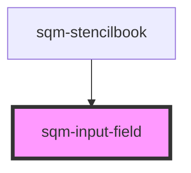

# sqm-input-field

<!-- Auto Generated Below -->

## Properties

| Property        | Attribute        | Description | Type                                                                                                                                                                                                            | Default             |
| --------------- | ---------------- | ----------- | --------------------------------------------------------------------------------------------------------------------------------------------------------------------------------------------------------------- | ------------------- |
| `demoData`      | --               |             | `{ states?: { validationErrors?: ValidationErrors; }; content?: { fieldName: string; fieldLabel: string; fieldType: "number" \| "text" \| "date" \| "tel"; fieldRequired?: boolean; errorMessage: string; }; }` | `undefined`         |
| `errorMessage`  | `error-message`  |             | `string`                                                                                                                                                                                                        | `"Cannot be empty"` |
| `fieldLabel`    | `field-label`    |             | `string`                                                                                                                                                                                                        | `"My Custom Input"` |
| `fieldName`     | `field-name`     |             | `string`                                                                                                                                                                                                        | `undefined`         |
| `fieldRequired` | `field-required` |             | `boolean`                                                                                                                                                                                                       | `true`              |
| `fieldType`     | `field-type`     |             | `"date" \| "number" \| "tel" \| "text"`                                                                                                                                                                         | `"text"`            |

## Dependencies

### Used by

 - [sqm-stencilbook](../sqm-stencilbook)

### Graph

----------------------------------------------

*Built with [StencilJS](https://stenciljs.com/)*
