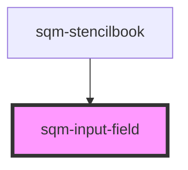

# sqm-input-field

<!-- Auto Generated Below -->

## Properties

| Property        | Attribute        | Description                                                                                                        | Type                                                                                                                                                                                                | Default             |
| --------------- | ---------------- | ------------------------------------------------------------------------------------------------------------------ | --------------------------------------------------------------------------------------------------------------------------------------------------------------------------------------------------- | ------------------- |
| `demoData`      | --               |                                                                                                                    | `{ states?: { validationErrors?: ValidationErrors; }; content?: { fieldName: string; fieldLabel: string; fieldType: "text" \| "date" \| "tel"; fieldOptional?: boolean; errorMessage: string; }; }` | `undefined`         |
| `errorMessage`  | `error-message`  |                                                                                                                    | `string`                                                                                                                                                                                            | `"Cannot be empty"` |
| `fieldLabel`    | `field-label`    |                                                                                                                    | `string`                                                                                                                                                                                            | `undefined`         |
| `fieldName`     | `field-name`     | This name is used as the key for this form field on submission. The name must be unique within this specific form. | `string`                                                                                                                                                                                            | `undefined`         |
| `fieldOptional` | `field-optional` |                                                                                                                    | `boolean`                                                                                                                                                                                           | `false`             |
| `fieldType`     | `field-type`     |                                                                                                                    | `"date" \| "tel" \| "text"`                                                                                                                                                                         | `"text"`            |

## Dependencies

### Used by

 - [sqm-stencilbook](../sqm-stencilbook)

### Graph

----------------------------------------------

*Built with [StencilJS](https://stenciljs.com/)*
