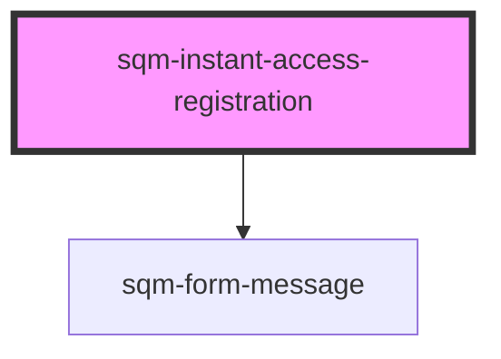

# sqm-portal-login

<!-- Auto Generated Below -->

## Properties

| Property                    | Attribute                      | Description                                                            | Type                                                                                                                                                                                                                                                                                                                                                                      | Default                           |
| --------------------------- | ------------------------------ | ---------------------------------------------------------------------- | ------------------------------------------------------------------------------------------------------------------------------------------------------------------------------------------------------------------------------------------------------------------------------------------------------------------------------------------------------------------------- | --------------------------------- |
| `demoData`                  | --                             |                                                                        | `{ states?: { error: string; loading: boolean; registrationFormState?: RegistrationFormState; }; content?: { removeBorder?: boolean; emailLabel?: string; firstNameLabel?: string; lastNameLabel?: string; registerLabel?: string; includeName?: boolean; topSlot?: VNode; bottomSlot?: VNode; invalidEmailErrorMessage: string; requiredFieldErrorMessage: string; }; }` | `undefined`                       |
| `emailLabel`                | `email-label`                  |                                                                        | `string`                                                                                                                                                                                                                                                                                                                                                                  | `"Email"`                         |
| `firstNameLabel`            | `first-name-label`             |                                                                        | `string`                                                                                                                                                                                                                                                                                                                                                                  | `"First Name"`                    |
| `includeName`               | `include-name`                 |                                                                        | `boolean`                                                                                                                                                                                                                                                                                                                                                                 | `false`                           |
| `invalidEmailErrorMessage`  | `invalid-email-error-message`  | The message to be displayed when the email used is invalid or blocked. | `string`                                                                                                                                                                                                                                                                                                                                                                  | `"Must be a valid email address"` |
| `lastNameLabel`             | `last-name-label`              |                                                                        | `string`                                                                                                                                                                                                                                                                                                                                                                  | `"Last Name"`                     |
| `registerLabel`             | `register-label`               |                                                                        | `string`                                                                                                                                                                                                                                                                                                                                                                  | `"Start Referring"`               |
| `removeBorder`              | `remove-border`                |                                                                        | `boolean`                                                                                                                                                                                                                                                                                                                                                                 | `false`                           |
| `requiredFieldErrorMessage` | `required-field-error-message` | The message to be displayed when a required field is not filled.       | `string`                                                                                                                                                                                                                                                                                                                                                                  | `"Cannot be empty"`               |

## Dependencies

### Depends on

- [sqm-form-message](../sqm-form-message)

### Graph

----------------------------------------------

*Built with [StencilJS](https://stenciljs.com/)*
