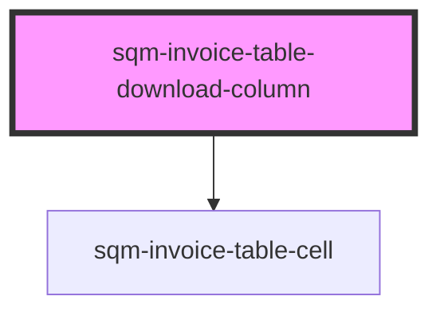

# sqm-referral-table-column

<!-- Auto Generated Below -->

## Properties

| Property      | Attribute      | Description | Type     | Default     |
| ------------- | -------------- | ----------- | -------- | ----------- |
| `columnTitle` | `column-title` |             | `string` | `undefined` |

## Methods

### `renderCell(_: Invoice) => Promise<any>`

#### Returns

Type: `Promise<any>`

### `renderLabel() => Promise<string>`

#### Returns

Type: `Promise<string>`

## Dependencies

### Depends on

- [sqm-invoice-table-cell](../cells)

### Graph

----------------------------------------------

*Built with [StencilJS](https://stenciljs.com/)*
