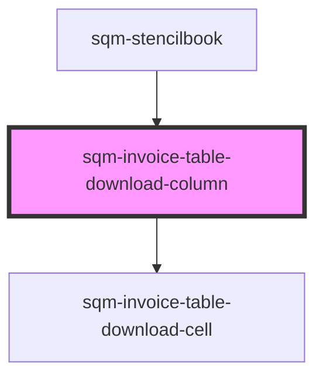

# sqm-referral-table-column

<!-- Auto Generated Below -->

## Methods

### `renderCell(data: Invoice) => Promise<any>`

#### Returns

Type: `Promise<any>`

### `renderLabel() => Promise<any>`

#### Returns

Type: `Promise<any>`

## Dependencies

### Used by

 - [sqm-stencilbook](../../sqm-stencilbook)

### Depends on

- [sqm-invoice-table-download-cell](../cells)

### Graph

----------------------------------------------

*Built with [StencilJS](https://stenciljs.com/)*
