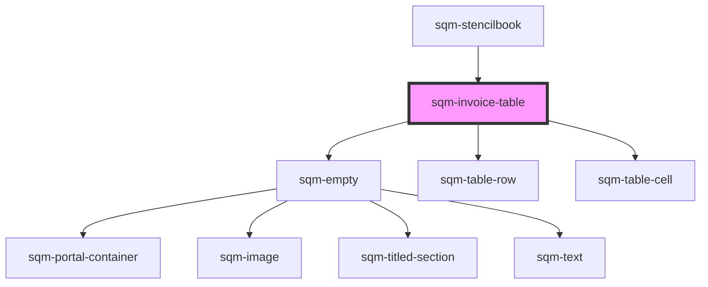

# sqm-referral-table

<!-- Auto Generated Below -->

## Properties

| Property        | Attribute        | Description                                                                                                                                                                                                                                                                | Type                                                                                                            | Default                                                                              |
| --------------- | ---------------- | -------------------------------------------------------------------------------------------------------------------------------------------------------------------------------------------------------------------------------------------------------------------------- | --------------------------------------------------------------------------------------------------------------- | ------------------------------------------------------------------------------------ |
| `demoData`      | --               |                                                                                                                                                                                                                                                                            | `Partial<Pick<GenericTableViewProps, "data" \| "states" \| "elements">> & { mockData?: { data: Invoice[]; }; }` | `undefined`                                                                          |
| `description`   | `description`    |                                                                                                                                                                                                                                                                            | `string`                                                                                                        | `"View and download your invoices to report your earnings and stay tax compliant. "` |
| `header`        | `header`         |                                                                                                                                                                                                                                                                            | `string`                                                                                                        | `"Invoices"`                                                                         |
| `hiddenColumns` | `hidden-columns` | Provide the column numbers (0 indexed) that should not be displayed in mobile views. Ex. 0,2,3                                                                                                                                                                             | `string`                                                                                                        | `"0"`                                                                                |
| `hideLabels`    | `hide-labels`    |                                                                                                                                                                                                                                                                            | `boolean`                                                                                                       | `false`                                                                              |
| `mdBreakpoint`  | `md-breakpoint`  |                                                                                                                                                                                                                                                                            | `number`                                                                                                        | `799`                                                                                |
| `moreLabel`     | `more-label`     |                                                                                                                                                                                                                                                                            | `string`                                                                                                        | `"Next"`                                                                             |
| `perPage`       | `per-page`       | Number of invoices displayed per page                                                                                                                                                                                                                                      | `number`                                                                                                        | `4`                                                                                  |
| `prevLabel`     | `prev-label`     |                                                                                                                                                                                                                                                                            | `string`                                                                                                        | `"Prev"`                                                                             |
| `programId`     | `program-id`     | Filters to only show invoices in this program. Will default to filtering by the program context where this table lives. If no program ID is set or provided by context, then shows all invoices from all programs. If program ID is "classic", shows classic-only invoices | `string`                                                                                                        | `undefined`                                                                          |
| `smBreakpoint`  | `sm-breakpoint`  |                                                                                                                                                                                                                                                                            | `number`                                                                                                        | `599`                                                                                |

## Dependencies

### Used by

 - [sqm-stencilbook](../sqm-stencilbook)

### Depends on

- [sqm-empty](../sqm-empty)
- [sqm-table-row](../sqm-table-row)
- [sqm-table-cell](../sqm-table-cell)

### Graph

----------------------------------------------

*Built with [StencilJS](https://stenciljs.com/)*
