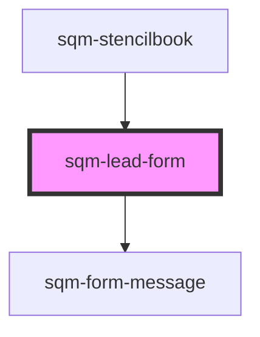

# sqm-portal-register

<!-- Auto Generated Below -->

## Properties

| Property                    | Attribute                      | Description                                                                | Type                                                                                                                                                                                                                                                                                                                                                     | Default                           |
| --------------------------- | ------------------------------ | -------------------------------------------------------------------------- | -------------------------------------------------------------------------------------------------------------------------------------------------------------------------------------------------------------------------------------------------------------------------------------------------------------------------------------------------------- | --------------------------------- |
| `demoData`                  | --                             |                                                                            | `{ states?: { error: string; loading: boolean; leadFormState: LeadFormState; referralCode: string; }; refs?: { formRef: any; }; content?: { formData?: VNode; emailLabel?: string; firstNameLabel?: string; lastNameLabel?: string; submitLabel?: string; pageLabel?: string; requiredFieldErrorMessage: string; invalidEmailErrorMessage: string; }; }` | `undefined`                       |
| `emailLabel`                | `email-label`                  |                                                                            | `string`                                                                                                                                                                                                                                                                                                                                                 | `"Email"`                         |
| `firstNameLabel`            | `first-name-label`             |                                                                            | `string`                                                                                                                                                                                                                                                                                                                                                 | `"First Name"`                    |
| `formKey`                   | `form-key`                     |                                                                            | `string`                                                                                                                                                                                                                                                                                                                                                 | `"lead-form"`                     |
| `invalidEmailErrorMessage`  | `invalid-email-error-message`  | The message to be displayed when the email used is invalid or blocked.     | `string`                                                                                                                                                                                                                                                                                                                                                 | `"Must be a valid email address"` |
| `lastNameLabel`             | `last-name-label`              |                                                                            | `string`                                                                                                                                                                                                                                                                                                                                                 | `"Last Name"`                     |
| `networkErrorMessage`       | `network-error-message`        | The message to be displayed when a the form submission fails unexpectedly. | `string`                                                                                                                                                                                                                                                                                                                                                 | `"Network request failed."`       |
| `nextPage`                  | `next-page`                    | Redirect participants to this page from their verification email           | `string`                                                                                                                                                                                                                                                                                                                                                 | `"/"`                             |
| `pageLabel`                 | `page-label`                   |                                                                            | `string`                                                                                                                                                                                                                                                                                                                                                 | `"Submit your information"`       |
| `requiredFieldErrorMessage` | `required-field-error-message` | The message to be displayed when a required field is not filled.           | `string`                                                                                                                                                                                                                                                                                                                                                 | `"Cannot be empty"`               |
| `submitLabel`               | `submit-label`                 |                                                                            | `string`                                                                                                                                                                                                                                                                                                                                                 | `"Submit"`                        |

## Dependencies

### Used by

 - [sqm-stencilbook](../sqm-stencilbook)

### Depends on

- [sqm-form-message](../sqm-form-message)

### Graph

----------------------------------------------

*Built with [StencilJS](https://stenciljs.com/)*
