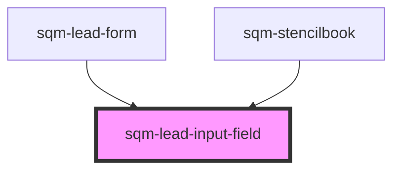

# sqm-portal-register

<!-- Auto Generated Below -->

## Properties

| Property                    | Attribute                      | Description                                                                                                        | Type                                                                                                                                                                                                                          | Default                        |
| --------------------------- | ------------------------------ | ------------------------------------------------------------------------------------------------------------------ | ----------------------------------------------------------------------------------------------------------------------------------------------------------------------------------------------------------------------------- | ------------------------------ |
| `demoData`                  | --                             |                                                                                                                    | `{ states?: { leadFormState?: LeadFormState; }; content?: { required: boolean; fieldName: string; fieldLabel: string; fieldType: "text" \| "date" \| "tel"; fieldOptional?: boolean; requiredFieldErrorMessage: string; }; }` | `undefined`                    |
| `fieldLabel`                | `field-label`                  |                                                                                                                    | `string`                                                                                                                                                                                                                      | `undefined`                    |
| `fieldName`                 | `field-name`                   | This name is used as the key for this form field on submission. The name must be unique within this specific form. | `string`                                                                                                                                                                                                                      | `undefined`                    |
| `fieldOptional`             | `field-optional`               |                                                                                                                    | `boolean`                                                                                                                                                                                                                     | `false`                        |
| `fieldType`                 | `field-type`                   |                                                                                                                    | `"date" \| "tel" \| "text"`                                                                                                                                                                                                   | `"text"`                       |
| `required`                  | `required`                     |                                                                                                                    | `boolean`                                                                                                                                                                                                                     | `false`                        |
| `requiredFieldErrorMessage` | `required-field-error-message` | The message to be displayed when a required field is not filled.                                                   | `string`                                                                                                                                                                                                                      | `"Please enter a {fieldName}"` |

## Dependencies

### Used by

 - [sqm-lead-form](.)
 - [sqm-stencilbook](../sqm-stencilbook)

### Graph

----------------------------------------------

*Built with [StencilJS](https://stenciljs.com/)*
