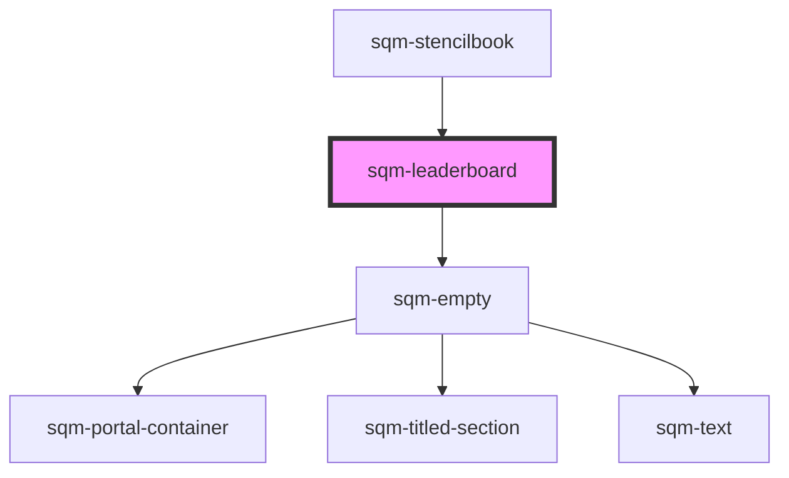

# sqm-leaderboard

<!-- Auto Generated Below -->

## Properties

| Property          | Attribute           | Description                                                                                                                                                                                             | Type                                                                                                                                                                                                                                                                                                                                                                                                                                                                                                                                                                                                                                   | Default            |
| ----------------- | ------------------- | ------------------------------------------------------------------------------------------------------------------------------------------------------------------------------------------------------- | -------------------------------------------------------------------------------------------------------------------------------------------------------------------------------------------------------------------------------------------------------------------------------------------------------------------------------------------------------------------------------------------------------------------------------------------------------------------------------------------------------------------------------------------------------------------------------------------------------------------------------------- | ------------------ |
| `anonymousUser`   | `anonymous-user`    | Title displayed for users without names                                                                                                                                                                 | `string`                                                                                                                                                                                                                                                                                                                                                                                                                                                                                                                                                                                                                               | `"Anonymous User"` |
| `demoData`        | --                  |                                                                                                                                                                                                         | `{ states?: { loading: boolean; hasLeaders: boolean; isEssentials?: boolean; styles: { usersheading: string; statsheading: string; rankheading?: string; showRank?: boolean; hideViewer?: boolean; viewingUserText?: string; hideNames?: boolean; anonymousUser?: string; rankSuffix?: string; width?: string; }; }; data?: { rankType: string; leaderboard: { textValue: string; rank: number; firstName: string; lastInitial: string; rowNumber: number; }[]; viewerRank?: { textValue: string; rank: number; firstName?: string; lastInitial?: string; rowNumber: number; }; }; elements?: { empty: VNode; essentials: VNode; }; }` | `undefined`        |
| `hideNames`       | `hide-names`        | Hide the Names of users to protect personal identifiable information                                                                                                                                    | `boolean`                                                                                                                                                                                                                                                                                                                                                                                                                                                                                                                                                                                                                              | `false`            |
| `hideViewer`      | `hide-viewer`       | Hide the viewer's leaderboard row if not in the top results.                                                                                                                                            | `boolean`                                                                                                                                                                                                                                                                                                                                                                                                                                                                                                                                                                                                                              | `false`            |
| `interval`        | `interval`          |                                                                                                                                                                                                         | `string`                                                                                                                                                                                                                                                                                                                                                                                                                                                                                                                                                                                                                               | `undefined`        |
| `isEssentials`    | `is-essentials`     | Hides the leaderboard if user is on Essentials plan                                                                                                                                                     | `boolean`                                                                                                                                                                                                                                                                                                                                                                                                                                                                                                                                                                                                                              | `false`            |
| `leaderboardType` | `leaderboard-type`  |                                                                                                                                                                                                         | `"topConvertedReferrers" \| "topPointEarners" \| "topStartedReferrers"`                                                                                                                                                                                                                                                                                                                                                                                                                                                                                                                                                                | `undefined`        |
| `maxRows`         | `max-rows`          | Control the maximum amount of rows displayed on the leaderboard.                                                                                                                                        | `number`                                                                                                                                                                                                                                                                                                                                                                                                                                                                                                                                                                                                                               | `10`               |
| `programId`       | `program-id`        | Filters leaderboard to show only data from this program. Defaults to the program context where this leaderboard is. If no program ID is set or provided by context, then a global leaderboard is shown. | `string`                                                                                                                                                                                                                                                                                                                                                                                                                                                                                                                                                                                                                               | `undefined`        |
| `rankSuffix`      | `rank-suffix`       | A JSONata string that formats the rank with the appropriate ordinal suffix (e.g., "st" for 1st, "nd" for 2nd, "rd" for 3rd, and "th" for all others).                                                   | `string`                                                                                                                                                                                                                                                                                                                                                                                                                                                                                                                                                                                                                               | `undefined`        |
| `rankType`        | `rank-type`         |                                                                                                                                                                                                         | `"denseRank" \| "rank" \| "rowNumber"`                                                                                                                                                                                                                                                                                                                                                                                                                                                                                                                                                                                                 | `undefined`        |
| `rankheading`     | `rankheading`       |                                                                                                                                                                                                         | `string`                                                                                                                                                                                                                                                                                                                                                                                                                                                                                                                                                                                                                               | `undefined`        |
| `showRank`        | `show-rank`         |                                                                                                                                                                                                         | `boolean`                                                                                                                                                                                                                                                                                                                                                                                                                                                                                                                                                                                                                              | `undefined`        |
| `statsheading`    | `statsheading`      |                                                                                                                                                                                                         | `string`                                                                                                                                                                                                                                                                                                                                                                                                                                                                                                                                                                                                                               | `undefined`        |
| `usersheading`    | `usersheading`      |                                                                                                                                                                                                         | `string`                                                                                                                                                                                                                                                                                                                                                                                                                                                                                                                                                                                                                               | `undefined`        |
| `viewingUserText` | `viewing-user-text` |                                                                                                                                                                                                         | `string`                                                                                                                                                                                                                                                                                                                                                                                                                                                                                                                                                                                                                               | `"You"`            |
| `width`           | `width`             | Restrict the width of the leaderboard (Can be a pixel value or a percentage i.e. "500px", "33%", etc.)                                                                                                  | `string`                                                                                                                                                                                                                                                                                                                                                                                                                                                                                                                                                                                                                               | `"100%"`           |

## Dependencies

### Used by

 - [sqm-stencilbook](../sqm-stencilbook)

### Depends on

- [sqm-empty](../sqm-empty)

### Graph

----------------------------------------------

*Built with [StencilJS](https://stenciljs.com/)*
