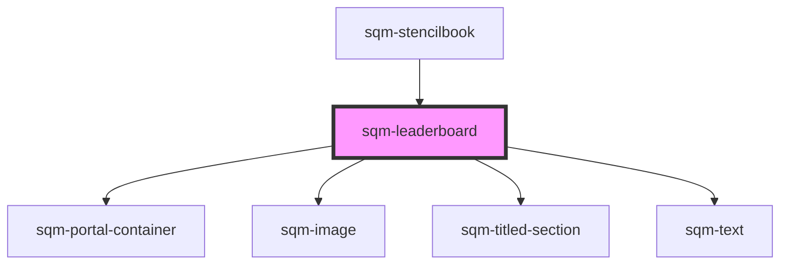

# sqm-leaderboard

<!-- Auto Generated Below -->

## Properties

| Property           | Attribute            | Description                                                                         | Type                                                                                                                                                                                                                                                                                                                                                                                                                                                                                                           | Default                                                                 |
| ------------------ | -------------------- | ----------------------------------------------------------------------------------- | -------------------------------------------------------------------------------------------------------------------------------------------------------------------------------------------------------------------------------------------------------------------------------------------------------------------------------------------------------------------------------------------------------------------------------------------------------------------------------------------------------------- | ----------------------------------------------------------------------- |
| `anonymousUser`    | `anonymous-user`     |                                                                                     | `string`                                                                                                                                                                                                                                                                                                                                                                                                                                                                                                       | `"Anonymous User"`                                                      |
| `demoData`         | --                   |                                                                                     | `{ states?: { loading: boolean; hasLeaders: boolean; styles: { usersheading: string; statsheading: string; rankheading?: string; showRank?: boolean; anonymousUser?: string; }; }; data?: { rankType: string; leaderboard: { value: number; rank: number; firstName: string; lastInitial: string; rowNumber: number; }[]; showUser?: boolean; userRank?: { value: number; rank: number; firstName: string; lastInitial: string; rowNumber: number; }; }; elements?: { empty: VNode; loadingstate: VNode; }; }` | `undefined`                                                             |
| `emptyStateHeader` | `empty-state-header` |                                                                                     | `string`                                                                                                                                                                                                                                                                                                                                                                                                                                                                                                       | `"View your rank in the leaderboard"`                                   |
| `emptyStateImage`  | `empty-state-image`  |                                                                                     | `string`                                                                                                                                                                                                                                                                                                                                                                                                                                                                                                       | `"https://i.imgur.com/KPGnPF8.png"`                                     |
| `emptyStateText`   | `empty-state-text`   |                                                                                     | `string`                                                                                                                                                                                                                                                                                                                                                                                                                                                                                                       | `"Be the first to refer a friend and reach the top of the leaderboard"` |
| `interval`         | `interval`           |                                                                                     | `string`                                                                                                                                                                                                                                                                                                                                                                                                                                                                                                       | `undefined`                                                             |
| `leaderboardType`  | `leaderboard-type`   |                                                                                     | `"topConvertedReferrers" \| "topStartedReferrers"`                                                                                                                                                                                                                                                                                                                                                                                                                                                             | `undefined`                                                             |
| `rankType`         | `rank-type`          |                                                                                     | `"denseRank" \| "rank" \| "rowNumber"`                                                                                                                                                                                                                                                                                                                                                                                                                                                                         | `undefined`                                                             |
| `rankheading`      | `rankheading`        |                                                                                     | `string`                                                                                                                                                                                                                                                                                                                                                                                                                                                                                                       | `"Rank"`                                                                |
| `showRank`         | `show-rank`          |                                                                                     | `boolean`                                                                                                                                                                                                                                                                                                                                                                                                                                                                                                      | `undefined`                                                             |
| `showUser`         | `show-user`          | Shows the current user's leaderboard information even if they are not in the top 10 | `boolean`                                                                                                                                                                                                                                                                                                                                                                                                                                                                                                      | `true`                                                                  |
| `statsheading`     | `statsheading`       |                                                                                     | `string`                                                                                                                                                                                                                                                                                                                                                                                                                                                                                                       | `undefined`                                                             |
| `usersheading`     | `usersheading`       |                                                                                     | `string`                                                                                                                                                                                                                                                                                                                                                                                                                                                                                                       | `undefined`                                                             |

## Dependencies

### Used by

 - [sqm-stencilbook](../sqm-stencilbook)

### Depends on

- [sqm-portal-container](../sqm-portal-container)
- [sqm-image](../sqm-image)
- [sqm-titled-section](../sqm-titled-section)
- [sqm-text](../sqm-text)

### Graph

----------------------------------------------

*Built with [StencilJS](https://stenciljs.com/)*
