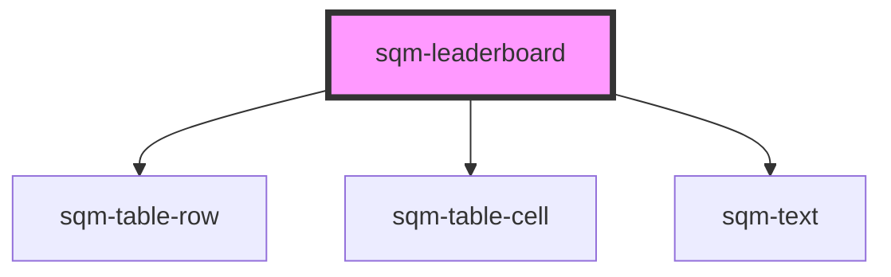

# sqm-leaderboard

<!-- Auto Generated Below -->

## Properties

| Property          | Attribute          | Description | Type                                                                                                                                                                                                                                                                                                                                                                                                                                                                                   | Default     |
| ----------------- | ------------------ | ----------- | -------------------------------------------------------------------------------------------------------------------------------------------------------------------------------------------------------------------------------------------------------------------------------------------------------------------------------------------------------------------------------------------------------------------------------------------------------------------------------------- | ----------- |
| `demoData`        | --                 |             | `{ states?: { loading: boolean; hasLeaders: boolean; styles: { usersheading: string; statsheading: string; rankheading?: string; showRank?: boolean; }; }; data?: { rankType: string; leaderboard: { value: number; rank: number; firstName: string; lastInitial: string; rowNumber: number; }[]; showUser?: boolean; userRank?: { value: number; rank: number; firstName: string; lastInitial: string; rowNumber: number; }; }; elements?: { empty: VNode; loadingstate: VNode; }; }` | `undefined` |
| `interval`        | `interval`         |             | `string`                                                                                                                                                                                                                                                                                                                                                                                                                                                                               | `undefined` |
| `leaderboardType` | `leaderboard-type` |             | `"topConvertedReferrers" \| "topStartedReferrers"`                                                                                                                                                                                                                                                                                                                                                                                                                                     | `undefined` |
| `rankType`        | `rank-type`        |             | `"denseRank" \| "rank" \| "rowNumber"`                                                                                                                                                                                                                                                                                                                                                                                                                                                 | `undefined` |
| `rankheading`     | `rankheading`      |             | `string`                                                                                                                                                                                                                                                                                                                                                                                                                                                                               | `undefined` |
| `showRank`        | `show-rank`        |             | `boolean`                                                                                                                                                                                                                                                                                                                                                                                                                                                                              | `undefined` |
| `showUser`        | `show-user`        |             | `boolean`                                                                                                                                                                                                                                                                                                                                                                                                                                                                              | `true`      |
| `statsheading`    | `statsheading`     |             | `string`                                                                                                                                                                                                                                                                                                                                                                                                                                                                               | `undefined` |
| `usersheading`    | `usersheading`     |             | `string`                                                                                                                                                                                                                                                                                                                                                                                                                                                                               | `undefined` |

## Dependencies

### Depends on

- [sqm-table-row](../sqm-table-row)
- [sqm-table-cell](../sqm-table-cell)
- [sqm-text](../sqm-text)

### Graph

----------------------------------------------

*Built with [StencilJS](https://stenciljs.com/)*
