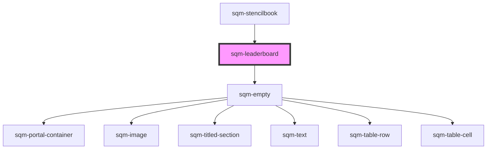

# sqm-leaderboard

<!-- Auto Generated Below -->

## Properties

| Property          | Attribute          | Description                                                                         | Type                                                                                                                                                                                                                                                                                                                                                                                                                                                                                                           | Default            |
| ----------------- | ------------------ | ----------------------------------------------------------------------------------- | -------------------------------------------------------------------------------------------------------------------------------------------------------------------------------------------------------------------------------------------------------------------------------------------------------------------------------------------------------------------------------------------------------------------------------------------------------------------------------------------------------------- | ------------------ |
| `anonymousUser`   | `anonymous-user`   |                                                                                     | `string`                                                                                                                                                                                                                                                                                                                                                                                                                                                                                                       | `"Anonymous User"` |
| `demoData`        | --                 |                                                                                     | `{ states?: { loading: boolean; hasLeaders: boolean; styles: { usersheading: string; statsheading: string; rankheading?: string; showRank?: boolean; anonymousUser?: string; }; }; data?: { rankType: string; leaderboard: { value: number; rank: number; firstName: string; lastInitial: string; rowNumber: number; }[]; showUser?: boolean; userRank?: { value: number; rank: number; firstName: string; lastInitial: string; rowNumber: number; }; }; elements?: { empty: VNode; loadingstate: VNode; }; }` | `undefined`        |
| `interval`        | `interval`         |                                                                                     | `string`                                                                                                                                                                                                                                                                                                                                                                                                                                                                                                       | `undefined`        |
| `leaderboardType` | `leaderboard-type` |                                                                                     | `"topConvertedReferrers" \| "topStartedReferrers"`                                                                                                                                                                                                                                                                                                                                                                                                                                                             | `undefined`        |
| `rankType`        | `rank-type`        |                                                                                     | `"denseRank" \| "rank" \| "rowNumber"`                                                                                                                                                                                                                                                                                                                                                                                                                                                                         | `undefined`        |
| `rankheading`     | `rankheading`      |                                                                                     | `string`                                                                                                                                                                                                                                                                                                                                                                                                                                                                                                       | `undefined`        |
| `showRank`        | `show-rank`        |                                                                                     | `boolean`                                                                                                                                                                                                                                                                                                                                                                                                                                                                                                      | `undefined`        |
| `showUser`        | `show-user`        | Shows the current user's leaderboard information even if they are not in the top 10 | `boolean`                                                                                                                                                                                                                                                                                                                                                                                                                                                                                                      | `false`            |
| `statsheading`    | `statsheading`     |                                                                                     | `string`                                                                                                                                                                                                                                                                                                                                                                                                                                                                                                       | `undefined`        |
| `usersheading`    | `usersheading`     |                                                                                     | `string`                                                                                                                                                                                                                                                                                                                                                                                                                                                                                                       | `undefined`        |

## Dependencies

### Used by

 - [sqm-stencilbook](../sqm-stencilbook)

### Depends on

- [sqm-empty](../sqm-empty)

### Graph

----------------------------------------------

*Built with [StencilJS](https://stenciljs.com/)*
