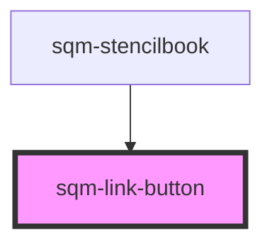

# sqm-image

<!-- Auto Generated Below -->

## Properties

| Property       | Attribute         | Description                                                                                                  | Type      | Default        |
| -------------- | ----------------- | ------------------------------------------------------------------------------------------------------------ | --------- | -------------- |
| `buttonText`   | `button-text`     |                                                                                                              | `string`  | `"Click here"` |
| `link`         | `link`            | URL that your button redirects to. Be sure to include the entire URL path (example: https://www.example.com) | `string`  | `undefined`    |
| `openInNewTab` | `open-in-new-tab` |                                                                                                              | `boolean` | `false`        |

## Dependencies

### Used by

 - [sqm-stencilbook](../sqm-stencilbook)

### Graph

----------------------------------------------

*Built with [StencilJS](https://stenciljs.com/)*
