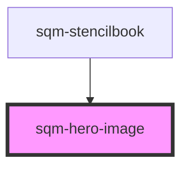

# sqm-media

<!-- Auto Generated Below -->

## Properties

| Property          | Attribute          | Description | Type                                                                                                                                           | Default                         |
| ----------------- | ------------------ | ----------- | ---------------------------------------------------------------------------------------------------------------------------------------------- | ------------------------------- |
| `backgroundColor` | `background-color` |             | `string`                                                                                                                                       | `undefined`                     |
| `buttonLink`      | `button-link`      |             | `string`                                                                                                                                       | `undefined`                     |
| `buttonNewTab`    | `button-new-tab`   |             | `boolean`                                                                                                                                      | `false`                         |
| `buttonText`      | `button-text`      |             | `string`                                                                                                                                       | `undefined`                     |
| `description`     | `description`      |             | `string`                                                                                                                                       | `undefined`                     |
| `header`          | `header`           |             | `string`                                                                                                                                       | `undefined`                     |
| `imageMobilePos`  | `image-mobile-pos` |             | `"bottom" \| "top"`                                                                                                                            | `"top"`                         |
| `imagePos`        | `image-pos`        |             | `"center" \| "left" \| "right"`                                                                                                                | `"center"`                      |
| `imageUrl`        | `image-url`        |             | `string`                                                                                                                                       | `undefined`                     |
| `layout`          | `layout`           |             | `"columns" \| "overlay"`                                                                                                                       | `"overlay"`                     |
| `minHeight`       | `min-height`       |             | `string`                                                                                                                                       | `"300px"`                       |
| `overlayColor`    | `overlay-color`    |             | `string`                                                                                                                                       | `"var(--sl-color-primary-900)"` |
| `overlayOpacity`  | `overlay-opacity`  |             | `string`                                                                                                                                       | `"0.75"`                        |
| `padding`         | `padding`          |             | `"large" \| "medium" \| "none" \| "small" \| "x-large" \| "x-small" \| "xx-large" \| "xx-small" \| "xxx-large" \| "xxx-small" \| "xxxx-large"` | `"xx-large"`                    |
| `textColor`       | `text-color`       |             | `string`                                                                                                                                       | `undefined`                     |

## Dependencies

### Used by

 - [sqm-stencilbook](../sqm-stencilbook)

### Graph

----------------------------------------------

*Built with [StencilJS](https://stenciljs.com/)*
