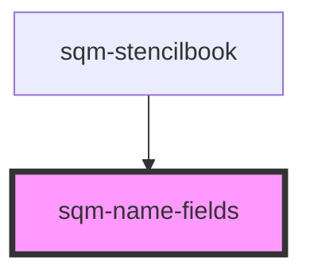

# sqm-name-fields

<!-- Auto Generated Below -->

## Properties

| Property         | Attribute          | Description | Type                                                                                                                  | Default        |
| ---------------- | ------------------ | ----------- | --------------------------------------------------------------------------------------------------------------------- | -------------- |
| `demoData`       | --                 |             | `{ states?: { validationErrors?: ValidationErrors; content: { firstNameLabel: string; lastNameLabel: string; }; }; }` | `undefined`    |
| `firstNameLabel` | `first-name-label` |             | `string`                                                                                                              | `"First Name"` |
| `lastNameLabel`  | `last-name-label`  |             | `string`                                                                                                              | `"Last Name"`  |

## Dependencies

### Used by

 - [sqm-stencilbook](../sqm-stencilbook)

### Graph

----------------------------------------------

*Built with [StencilJS](https://stenciljs.com/)*
