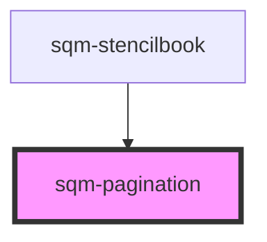

# sqm-pagination

<!-- Auto Generated Below -->

## Properties

| Property         | Attribute         | Description                                                 | Type                       | Default                           |
| ---------------- | ----------------- | ----------------------------------------------------------- | -------------------------- | --------------------------------- |
| `buttonType`     | `button-type`     | The type of the button that is used (primary or secondary). | `"primary" \| "secondary"` | `"secondary"`                     |
| `demoData`       | --                |                                                             | `{}`                       | `undefined`                       |
| `paginationText` | `pagination-text` |                                                             | `string`                   | `"{currentPage} of {totalPages}"` |

## Dependencies

### Used by

 - [sqm-stencilbook](../sqm-stencilbook)

### Graph

----------------------------------------------

*Built with [StencilJS](https://stenciljs.com/)*
