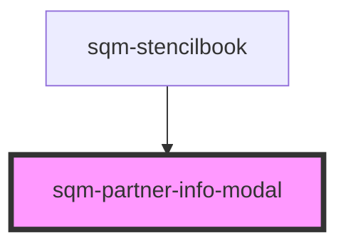

# sqm-partner-info-modal

<!-- Auto Generated Below -->

## Properties

| Property                     | Attribute                      | Description                                   | Type                                                                                                                                                                                                                                                                                                                                       | Default                                                                                |
| ---------------------------- | ------------------------------ | --------------------------------------------- | ------------------------------------------------------------------------------------------------------------------------------------------------------------------------------------------------------------------------------------------------------------------------------------------------------------------------------------------ | -------------------------------------------------------------------------------------- |
| `brandName`                  | `brand-name`                   | Brand name shown in the modal header          | `string`                                                                                                                                                                                                                                                                                                                                   | `""`                                                                                   |
| `confirmButtonLabel`         | `confirm-button-label`         |                                               | `string`                                                                                                                                                                                                                                                                                                                                   | `"Confirm"`                                                                            |
| `countryLabel`               | `country-label`                |                                               | `string`                                                                                                                                                                                                                                                                                                                                   | `"Country"`                                                                            |
| `currencyLabel`              | `currency-label`               |                                               | `string`                                                                                                                                                                                                                                                                                                                                   | `"Currency"`                                                                           |
| `demoData`                   | --                             |                                               | `{ states?: { open: boolean; loading: boolean; submitting: boolean; isExistingPartner: boolean; countryCode: string; currency: string; error: string; success: boolean; brandName: string; filteredCountries: { countryCode: string; displayName: string; }[]; filteredCurrencies: { currencyCode: string; displayName: string; }[]; }; }` | `undefined`                                                                            |
| `descriptionExistingPartner` | `description-existing-partner` | Description for existing partner confirmation | `string`                                                                                                                                                                                                                                                                                                                                   | `"We noticed you are already an Impact.com partner, please confirm your information."` |
| `descriptionNewPartner`      | `description-new-partner`      | Description for new partner setup             | `string`                                                                                                                                                                                                                                                                                                                                   | `"We just need a bit more information about you before you start earning cash!"`       |
| `missingFieldsErrorText`     | `missing-fields-error-text`    |                                               | `string`                                                                                                                                                                                                                                                                                                                                   | `"Please select both a country and currency."`                                         |
| `modalBrandHeader`           | `modal-brand-header`           | Header text when user has no existing partner | `string`                                                                                                                                                                                                                                                                                                                                   | `"Welcome to {brandName} Program!"`                                                    |
| `networkErrorText`           | `network-error-text`           |                                               | `string`                                                                                                                                                                                                                                                                                                                                   | `"An error occurred. Please try again."`                                               |
| `searchCountryPlaceholder`   | `search-country-placeholder`   |                                               | `string`                                                                                                                                                                                                                                                                                                                                   | `"Search for a country"`                                                               |
| `searchCurrencyPlaceholder`  | `search-currency-placeholder`  |                                               | `string`                                                                                                                                                                                                                                                                                                                                   | `"Search for a currency"`                                                              |
| `submitButtonLabel`          | `submit-button-label`          |                                               | `string`                                                                                                                                                                                                                                                                                                                                   | `"Submit"`                                                                             |

## Dependencies

### Used by

 - [sqm-stencilbook](../sqm-stencilbook)

### Graph

----------------------------------------------

*Built with [StencilJS](https://stenciljs.com/)*
