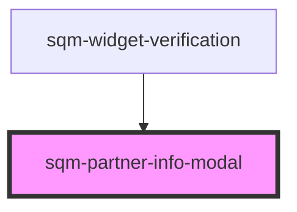

# sqm-partner-info-modal

<!-- Auto Generated Below -->

## Properties

| Property                            | Attribute                              | Description                                                                                                 | Type                                                                                                                                                                                                                                                                                                                                                                                                                  | Default                                                                                                                                                               |
| ----------------------------------- | -------------------------------------- | ----------------------------------------------------------------------------------------------------------- | --------------------------------------------------------------------------------------------------------------------------------------------------------------------------------------------------------------------------------------------------------------------------------------------------------------------------------------------------------------------------------------------------------------------- | --------------------------------------------------------------------------------------------------------------------------------------------------------------------- |
| `allowBankingCollection`            | `allow-banking-collection`             | Edit the property called terms and conditions text to change what's displayed for {termsAndConditionsLink}. | `string`                                                                                                                                                                                                                                                                                                                                                                                                              | `"I have read the {termsAndConditionsLink} and allow impact.com to collect my tax and banking information"`                                                           |
| `brandName`                         | `brand-name`                           | Brand name shown in the modal header                                                                        | `string`                                                                                                                                                                                                                                                                                                                                                                                                              | `""`                                                                                                                                                                  |
| `confirmButtonLabel`                | `confirm-button-label`                 |                                                                                                             | `string`                                                                                                                                                                                                                                                                                                                                                                                                              | `"Confirm"`                                                                                                                                                           |
| `countryLabel`                      | `country-label`                        |                                                                                                             | `string`                                                                                                                                                                                                                                                                                                                                                                                                              | `"Country"`                                                                                                                                                           |
| `currencyLabel`                     | `currency-label`                       |                                                                                                             | `string`                                                                                                                                                                                                                                                                                                                                                                                                              | `"Currency"`                                                                                                                                                          |
| `demoData`                          | --                                     |                                                                                                             | `{ states?: { open: boolean; loading: boolean; submitting: boolean; isExistingPartner: boolean; countryCode: string; currency: string; error: string; success: boolean; brandName: string; filteredCountries: { countryCode: string; displayName: string; }[]; filteredCurrencies: { currencyCode: string; displayName: string; }[]; allowBankingCollection: boolean; checkboxError: string; disabled: boolean; }; }` | `undefined`                                                                                                                                                           |
| `descriptionExistingPartner`        | `description-existing-partner`         | Description for existing partner confirmation                                                               | `string`                                                                                                                                                                                                                                                                                                                                                                                                              | `"We found an account with this email on our referral program provider, impact.com. Please confirm your country and currency now to get your future rewards faster."` |
| `descriptionNewPartner`             | `description-new-partner`              | Description for new partner setup                                                                           | `string`                                                                                                                                                                                                                                                                                                                                                                                                              | `"Confirm your country and currency now to get your future rewards faster."`                                                                                          |
| `inModal`                           | `in-modal`                             | Used to render in another modal.                                                                            | `boolean`                                                                                                                                                                                                                                                                                                                                                                                                             | `false`                                                                                                                                                               |
| `missingFieldsErrorText`            | `missing-fields-error-text`            |                                                                                                             | `string`                                                                                                                                                                                                                                                                                                                                                                                                              | `"Please select both a country and currency."`                                                                                                                        |
| `modalHeader`                       | `modal-header`                         | Header text when user has no existing partner                                                               | `string`                                                                                                                                                                                                                                                                                                                                                                                                              | `"Let's get you ready for rewards"`                                                                                                                                   |
| `modalHeaderExistingPartner`        | `modal-header-existing-partner`        | Header text when user has an existing partner                                                               | `string`                                                                                                                                                                                                                                                                                                                                                                                                              | `"We found an existing account"`                                                                                                                                      |
| `networkErrorText`                  | `network-error-text`                   |                                                                                                             | `string`                                                                                                                                                                                                                                                                                                                                                                                                              | `"An error occurred. Please try again."`                                                                                                                              |
| `searchCountryPlaceholder`          | `search-country-placeholder`           |                                                                                                             | `string`                                                                                                                                                                                                                                                                                                                                                                                                              | `"Search for a country"`                                                                                                                                              |
| `searchCurrencyPlaceholder`         | `search-currency-placeholder`          |                                                                                                             | `string`                                                                                                                                                                                                                                                                                                                                                                                                              | `"Search for a currency"`                                                                                                                                             |
| `stateController`                   | `state-controller`                     |                                                                                                             | `string`                                                                                                                                                                                                                                                                                                                                                                                                              | `"{}"`                                                                                                                                                                |
| `submitButtonLabel`                 | `submit-button-label`                  |                                                                                                             | `string`                                                                                                                                                                                                                                                                                                                                                                                                              | `"Submit"`                                                                                                                                                            |
| `supportDescriptionExistingPartner` | `support-description-existing-partner` | Support description for existing partner confirmation                                                       | `string`                                                                                                                                                                                                                                                                                                                                                                                                              | `"If this is a mistake, please contact Support or sign up for this referral program with a different email."`                                                         |
| `termsAndConditionsLabel`           | `terms-and-conditions-label`           | The link text that appears in the terms and conditions checkbox                                             | `string`                                                                                                                                                                                                                                                                                                                                                                                                              | `"terms and conditions"`                                                                                                                                              |
| `termsAndConditionsLink`            | `terms-and-conditions-link`            | The link that appears in the terms and conditions checkbox                                                  | `string`                                                                                                                                                                                                                                                                                                                                                                                                              | `"https://terms.advocate.impact.com/PayoutTermsAndConditions.html"`                                                                                                   |

## Dependencies

### Used by

 - [sqm-widget-verification](../sqm-widget-verification)

### Graph

----------------------------------------------

*Built with [StencilJS](https://stenciljs.com/)*
