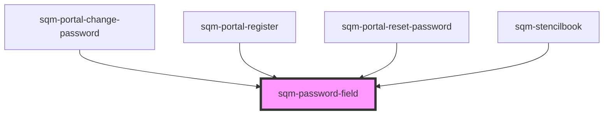

# sqm-portal-reset-password

<!-- Auto Generated Below -->

## Properties

| Property           | Attribute           | Description | Type                                                                                                                                                 | Default      |
| ------------------ | ------------------- | ----------- | ---------------------------------------------------------------------------------------------------------------------------------------------------- | ------------ |
| `demoData`         | --                  |             | `{ states?: { enableValidation: boolean; dynamicValidation: VNode; validationErrors: Record<string, string>; content: { fieldLabel: string; }; }; }` | `undefined`  |
| `enableValidation` | `enable-validation` |             | `boolean`                                                                                                                                            | `true`       |
| `fieldLabel`       | `field-label`       |             | `string`                                                                                                                                             | `"Password"` |

## Dependencies

### Used by

 - [sqm-portal-change-password](../sqm-portal-change-password)
 - [sqm-portal-register](../sqm-portal-register)
 - [sqm-portal-reset-password](../sqm-portal-reset-password)
 - [sqm-stencilbook](../sqm-stencilbook)

### Graph

----------------------------------------------

*Built with [StencilJS](https://stenciljs.com/)*
