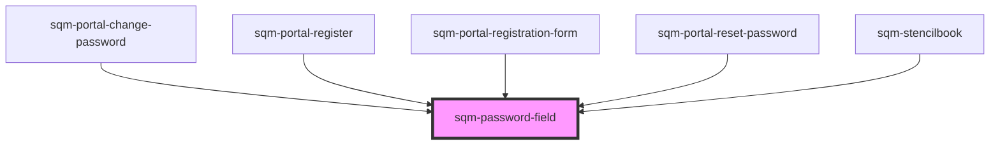

# sqm-password-field

<!-- Auto Generated Below -->

## Properties

| Property                      | Attribute                         | Description                      | Type                         | Default                                            |
| ----------------------------- | --------------------------------- | -------------------------------- | ---------------------------- | -------------------------------------------------- |
| `demoData`                    | --                                |                                  | `PasswordFieldViewDemoProps` | `undefined`                                        |
| `disableValidation`           | `disable-validation`              | Disable live password validation | `boolean`                    | `false`                                            |
| `doesNotMeetRequirementsText` | `does-not-meet-requirements-text` |                                  | `string`                     | `"Password must meet the following requirements:"` |
| `fieldLabel`                  | `field-label`                     | Label for password field         | `string`                     | `"Password"`                                       |
| `hasError`                    | `has-error`                       |                                  | `string`                     | `"contain at least 1 number or symbol"`            |
| `lowercaseError`              | `lowercase-error`                 |                                  | `string`                     | `"contain at least 1 lowercase character"`         |
| `meetsRequirementsText`       | `meets-requirements-text`         |                                  | `string`                     | `"Password has met all requirements"`              |
| `minError`                    | `min-error`                       |                                  | `string`                     | `"be a minimum of 8 characters"`                   |
| `uppercaseError`              | `uppercase-error`                 |                                  | `string`                     | `"contain at least 1 uppercase character"`         |

## Dependencies

### Used by

 - [sqm-portal-change-password](../sqm-portal-change-password)
 - [sqm-portal-register](../sqm-portal-register)
 - [sqm-portal-registration-form](../sqm-portal-registration-form)
 - [sqm-portal-reset-password](../sqm-portal-reset-password)
 - [sqm-stencilbook](../sqm-stencilbook)

### Graph

----------------------------------------------

*Built with [StencilJS](https://stenciljs.com/)*
